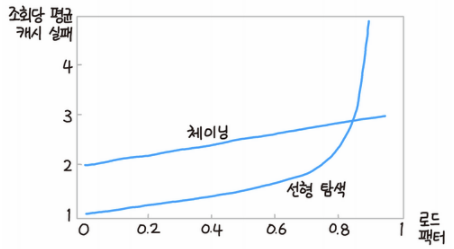
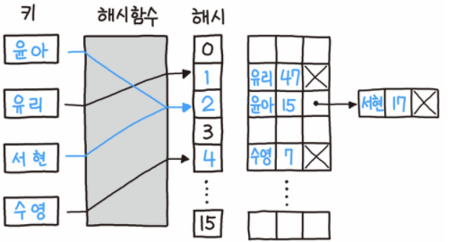
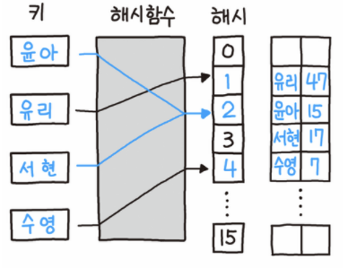

# Hash Table(해시 테이블)

## 개념
- `해싱(Hashing)`
	- 임의의 길이의 값을 `해시함수(Hash Function)`를 사용하여 고정된 크기의 값으로 변환하는 작업을 의미한다.
- 해싱을 사용하여 변환된 값(hash value)을 index로 삼아 `(key, value)`를 저장하는 저장하는 자료구조를 `해시 테이블(Hash Table)`이라고 한다.
	- 삽입, 삭제, 탐색 연산 모두 `O(1)`을 기대할 수 있다.
- 해시 알고리즘이 견고하지 못하면 해시함수로 도출된 값들이 같은 경우가 빈번하게 발생하게 되며, 이를 `충돌(Collision)`이라고 말한다.
- 좋은 성능의 해시 테이블을 구현하기 위해서는 다음과 같다.
	1. 충돌이 거의 발생하지 않는 해시함수를 구현
		- 본인이 구현한 해시함수는 `modulo연산`을 이용하였으나, 여러가지 방식의 해시함수가 존재한다
			> 대표적 해시 함수 : MD5, SHA, HAS, ...
	2. 충돌이 발생했을 때, 적절한 대처
## Collision Handling

- 최악의 경우, 충돌이 빈번하게 일어나서 삽입, 삭제, 탐색 연산이 `O(N)`까지 걸릴 수도 있다.
- `적재율(Load Factor) α`
	- `α = n / N`
		- n : 해시 테이블에 존재하는 데이터 개수
		- N : 해시 테이블의 크기
	- 적재율이 낮을수록 충돌 가능성이 낮다.
- 평균 탐사율 = `1 / (1 - α)`
### Seperate Chaining

- `개별 체이닝(Seperate Chanining)`
	- 충돌 발생 시, 그림과 같이 연결 리스트로 연결하는 방식이다.
	- `폐쇄 주소(Close Addressing)`방식이라고도 불린다.
		> ex) C++, Java, Go, ...
- 구현
	- cell 구조체
	```c++
	struct cell {
		int flag;
		chain* next;
		cell()
			: flag(NOITEM), next(nullptr) {}
	};
	```
	- chain 구조체
	```c++
	struct chain {
		int key;
		int value;
		chain* next;
		chain() 
			: key(EMPTY), value(EMPTY), next(nullptr) {}
		chain(int key, int value)
			: key(key), value(value), next(nullptr) {}
	};
	```
	- 해시함수
		- `h(k) = k mod N`
			- 여기서 N은 2의 제곱꼴을 사용하면 안된다고 하는데, 이는 그 제곱꼴이 2ⁿ 으로 나타날 때, k의 하위 n개의 비트를 고려하지 않는다고 한다. 
			- 따라서 N은 `소수(Prime Number)`를 사용하는 것이 좋다.
		```c++
		int hashfunc(int idx) {
			return idx % MAX;
		}
		```
	- 삽입 연산
		- 충돌이 발생하면, 링크드 리스트 형태로 연결시켜서 데이터를 삽입한다.
	```c++
	void Insert(int key, int value) {
		if (hashArr[hashfunc(key)]->flag == NOITEM) {
			hashArr[hashfunc(key)]->flag = ISITEM;
			hashArr[hashfunc(key)]->next = new chain(key, value);
		}
		else {
			chain* cur = hashArr[hashfunc(key)]->next;
			while (cur->next != nullptr) 
				cur = cur->next;
			cur->next = new chain(key, value);
		}
	}
	```
	- 삭제 연산
		- 해싱으로 cell의 위치를 찾은 다음, 체인을 하나하나 탐색하면서 해당 데이터를 삭제한다.
		- 데이터를 삭제함으로써 해당 cell에 더 이상 체인이 없는 경우 flag를 `NOITEM`으로 변경한다.
	```c++
	void Delete(int key) {
		if (hashArr[hashfunc(key)]->flag == ISITEM) {
			chain* cur = hashArr[hashfunc(key)]->next;
			if (cur->key == key) {
				if (cur->next == nullptr)
					hashArr[hashfunc(key)]->flag = NOITEM;
				hashArr[hashfunc(key)]->next = cur->next;
				delete cur;
			}
			else {
				while (cur) {
					if (cur->next->key == key) {
						chain* del = cur->next;
						cur->next = cur->next->next;
						delete del;
					}
					cur = cur->next;
				}
			}
		}
	}
	```
	- 탐색 연산
		- 해싱으로 cell의 위치를 찾은 다음, 체인을 하나하나 탐색하면서 해당 데이터를 찾아 반환한다.
		- 해당 데이터가 없으면 -1을 반환한다.
	```c++
	int Search(int key) {
		if (hashArr[hashfunc(key)]->flag == ISITEM) {
			chain* cur = hashArr[hashfunc(key)]->next;
			while (cur != nullptr) {
				if (cur->key == key) 
					return cur->value;
				cur = cur->next;
			}
		}

		return -1;
	}
	```
### Open Addressing

- `Open Addressing(개방 주소)`방식은, 충돌 발생 시 그림과 같이 탐사를 통해 빈 공간을 찾아나가는 방식이다.
- 종류
	- `선형 탐사(Linear Probing)`
		- 충돌이 발생한 경우, 바로 다음 빈 공간을 찾아 데이터를 삽입하는 방식이다.
		- 바로 인접한 index에 데이터를 삽입하기 때문에, `Clustering` 문제가 발생할 수 있다.
	- `제곱 탐사(Quadratic Probing)`
		- 충돌이 발생한 경우 1², 2², 3,², ... 으로 탐사하며 빈 공간을 찾아 데이터를 삽입하는 방식이다.
		- 이 또한, 초기 해시값이 같을 경우 `Clustering` 문제가 발생하게 된다.
	- `이중 해싱(Double Hashing)`
		- 선형 탐사와 제곱 탐사에서 발생하는 `Clustering` 문제를 회피하기 위해 도입된 방식이다.
		- 해시값을 반환하는 해시함수와, 충돌이 발생했을 때 탐사폭을 계산하기 위한 해시함수를 이용한다.
- 구현
	- cell 구조체
	```c++
	struct cell {
		int key;
		int flag;
		int value;
		cell() 
			: key(EMPTY), flag(NOITEM), value(EMPTY) {}
	};
	```
	- 해시함수
		- `h₁(k) = k mod N`
			- 여기서 N은 2의 제곱꼴을 사용하면 안된다고 하는데, 이는 그 제곱꼴이 2ⁿ 으로 나타날 때, k의 하위 n개의 비트를 고려하지 않는다고 한다. 
			- 따라서 N은 `소수(Prime Number)`를 사용하는 것이 좋다.
		```c++
		int hashfunc(int idx) {
			return idx % MAX;
		}
		```
		- `h₂(k) = q - (k mod q)`
			- 여기서 q는 `N보다 작은 소수(Prime Number)`를 사용해야 한다.
		```c++
		int hashfunc2(int idx) {
			return (17 - (idx % 17));
		}
		```
	- 이중 해싱(Double Hashing) 
		- `h₁(h₁(x) + probing * h₂(x))`
	- 삽입 연산
		- 이중 해싱으로 cell의 flag가 `NOITEM` 혹은 `AVAILABLE`이 나올 때 까지 탐사하고, 데이터를 삽입한다.
	```c++
	void Insert(int key, int value) {
		int probing = 0;

		while (hashArr[hashfunc(hashfunc(key) + (probing * hashfunc2(key)))].flag == ISITEM) 
			probing++;

		hashArr[hashfunc(hashfunc(key) + (probing * hashfunc2(key)))].key = key;
		hashArr[hashfunc(hashfunc(key) + (probing * hashfunc2(key)))].flag = ISITEM;
		hashArr[hashfunc(hashfunc(key) + (probing * hashfunc2(key)))].value = value;
	}
	```
	- 삭제 연산
		- 이중 해싱으로 cell의 flag가 `NOITEM`이 나올 때 까지 탐사하면서, 해당 데이터를 찾으면 해당 cell의 데이터를 제거하고, cell의 flag를 `AVAILABLE`으로 변경한다.
	```c++
	void Delete(int key) {
		int probing = 0;

		while (hashArr[hashfunc(hashfunc(key) + probing * hashfunc2(key))].flag != NOITEM) {
			if (hashArr[hashfunc(hashfunc(key) + probing * hashfunc2(key))].key == key) {
				hashArr[hashfunc(hashfunc(key) + probing * hashfunc2(key))].key = EMPTY;
				hashArr[hashfunc(hashfunc(key) + probing * hashfunc2(key))].flag = AVAILABLE;
				hashArr[hashfunc(hashfunc(key) + probing * hashfunc2(key))].value = EMPTY;
				return;
			}
			probing++;
		}
	}
	```
	- 탐색 연산
		- 이중 해싱으로 상태가 `NOITEM`이 나올 때 까지 탐사하면서 해당 데이터를 찾으면, 해당 cell의 value를 반환한다.
	```c++
	int Search(int key) {
		int probing = 0;

		while (hashArr[hashfunc(hashfunc(key) + (probing * hashfunc2(key)))].flag != NOITEM) {
			if (hashArr[hashfunc(hashfunc(key) + (probing * hashfunc2(key)))].key == key) 
				return hashArr[hashfunc(hashfunc(key) + (probing * hashfunc2(key)))].value;	
			probing++;
		}
		return -1;
	}
	```