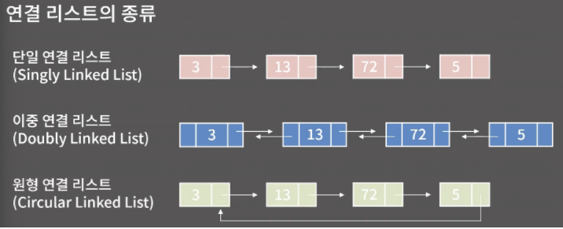
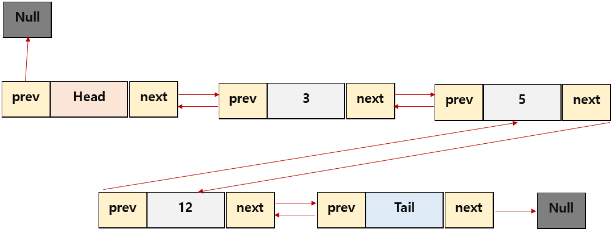

# Linked List, 연결 리스트

## 개념
- 각 Node가 `원소(element)`와 `포인터(pointer)`를 가지고 한 줄로 연결되어 있는 방식으로 데이터를 저장하는 선형 자료 구조이다

## 종류

### 단일 연결 리스트
- 단일 연결 리스트는 각 노드에 자료 공간과 한 개의 포인터 공간이 있고, 각 노드의 포인터는 다음 노드를 가리킨다.
### 이중 연결 리스트
- 이중 연결 리스트의 구조는 단일 연결 리스트와 비슷하지만, 포인터 공간이 두 개가 있고 각각의 포인터는 앞의 노드와 뒤의 노드를 가리킨다.
### 원형 연결 리스트
- 원형 연결 리스트는 일반적인 연결 리스트에 마지막 노드와 처음 노드를 연결시켜 원형으로 만든 구조이다.

## 특징
- 원소를 추가 할 때마다 메모리 할당을 하기 때문에, 별도의 메모리 공간을 확보해 두지 않아도 된다.
- `삽입/삭제` 연산은 `O(1)`에 가능하지만, 임의의 위치를 `탐색`하는 연산은 `O(N)`까지 걸릴 수 있다.

## 구현
- `이중 연결 리스트`를 구현하였으며, C++ STL에서 `list`에 해당한다.
### Node 클래스
```c++
template <typename T>
class Node {
// 외부에서 Node 클래스에 접근하지 못하도록 prviate 내에서 구현.
private:
	T element;
	Node<T>* next; // next Node를 가리키는 ptr
	Node<T>* prev; // prev Node를 가리키는 ptr
	Node() { this->next = this->prev = nullptr; }
	Node(const T& element) {
		this->element = element;
		this->next = this->prev = nullptr;
	}
	// DoublyLinkedList 클래스에게만 접근 권한을 내어 줌.
	friend class DoublyLinkedList<T>;
};
```
### Doubly Linked List 클래스
```c++
template <typename T>
class DoublyLinkedList {
private:
	int _size;		// Node 갯수
	Node<T>* head;	// list 맨 앞의 element가 존재하지 않는 노드형 포인터
	Node<T>* tail;	// lsit 맨 뒤의 element가 존재하지 않는 노드형 포인터
	T* tmplist;	// merge할 때, 별도로 메모리를 확보하기 위해 선언.
	void merge(int, int) noexcept;
	void partition(int, int) noexcept;

public:
	DoublyLinkedList();
	~DoublyLinkedList();
	class Iterator;
	class rIterator;
	Iterator begin() noexcept;
	Iterator rbegin() noexcept;
	Iterator end() noexcept;
	Iterator rend() noexcept;
	void sort() noexcept;
	void unique() noexcept;
	void clear() noexcept;
	void insert(const Iterator&, const T&) noexcept;
	void push_front(const T&) noexcept;
	void push_back(const T&) noexcept;
	void erase(const Iterator&) noexcept;
	void remove(const T&) noexcept;
	T front() const noexcept(noexcept(!empty()));
	T back() const noexcept(noexcept(!empty()));
	int size const noexcept;
	bool empty() const noexcept;
```

#### 생성자/소멸자
```c++
DoublyLinkedList() {
		// head와 tail에 메모리를 할당해주고, 서로 연결시킨다.
		this->head = new Node<T>();
		this->tail = new Node<T>();
		this->head->next = this->tail;
		this->tail->prev = this->head;
		this->_size = 0;
}
~DoublyLinkedList() {
	// 
	clear();
	delete this->head;
	delete this->tail;
}
```
#### 구조

- Head와 Tail은 처음과 끝의 포인터 역할만하며, element는 저장하지 않는다.
- 이러한 구조는, 삽입/삭제 마다 head와 tail을 갱신해주어야 하는 번거로움을 없애준다.

#### 삽입
```c++
// 현재 iterator에 Node를 추가하는 함수
void insert(const Iterator& iter, const T& element) noexcept {
		Node<T>* curNode = iter.curNode;
		Node<T>* prevNode = curNode->prev;
		Node<T>* newNode = new Node<T>(element);

		// 현재 iterator의 Node의 앞 쪽에 newNode를 삽입하는 과정
		newNode->next = curNode;
		curNode->prev = newNode;
		newNode->prev = prevNode;
		prevNode->next = newNode;

		this->_size++;
	}

void push_front(const T& element) noexcept { insert(begin(), element); }
void push_back(const T& element) noexcept { insert(end(), element); }
```

#### 삭제
```c++
// 현재 iterator의 Node를 제거하는 함수
void erase(const Iterator& iter) noexcept {
		Node<T>* curNode = iter.curNode;
		Node<T>* nextNode = curNode->next;
		Node<T>* prevNode = curNode->prev;

		// 현재 iterator의 Node의 앞 뒤 노드를 서로 연결시키는 과정
		prevNode->next = nextNode;
		nextNode->prev = prevNode;

		// 현재 iterator의 Node의 메모리를 반환
		delete curNode;
		empty() ? this->_size = 0 : this->_size--;
}
void pop_front() noexcept { erase(begin(); }
void pop_back() noexcept { erase(--end()); }

// iterator를 돌면서, 매개변수로 받은 element값을 갖는 Node를 찾아서 제거하는 함수
void remove(const T& element) noexcept {
	for (Iterator iter = begin(); iter !=end(); ++iter) {
		if (iter.curNode->element ==element) {
			erase(iter);
			return;
		}
	}
}
```
#### Iterator 구현
```c++
class Iterator {
private:
	Node<T>* curNode;
	Iterator(Node<T>* curNode) {
		this->curNode = curNode;
	}
	friend class DoublyLinkedList<T>;

public:
	// 현재 iterator의 Node의 element를 반환
	T& operator*() noexcept {
		return this->curNode->element;
	}
	// 각 iterator의 Node를 비교(==)
	bool operator==(const Iterator& ptr) const noexcept {
		return this->curNode == ptrcurNode;
	}
	// 각 iterator의 Node를 비교(!=)
	bool operator!=(const Iterator& ptr) const noexcept {
		return this->curNode != ptrcurNode;
	}
	// 현재 iterator의 Node를 nextNode로 변경
	Iterator& operator++() noexcept {
		this->curNode = this->curNode->next;
		return *this;
	}
	// 현재 iterator의 Node를 ptrevNode로 변경
	Iterator& operator--() noexcept {
		this->curNode = this->curNode->prev;
		return *this;
	}
};
```
- 추가로, reverse version의 iterator도 구현하였다.
```c++
class rIterator {
private:
	Node<T>* curNode;
	rIterator(Node<T>* curNode) {
		this->curNode = curNode;
	}
	friend class DoublyLinkedList<T>;
public:
	T& operator*() noexcept {
		return this->curNode->element;
	}
	bool operator ==(const rIterator& ptr)const noexcept {
		return this->curNode == ptrcurNode;
	}
	bool operator !=(const rIterator& ptr)const noexcept {
		return this->curNode != ptrcurNode;
	}
	rIterator& operator--() noexcept {
		this->curNode =this->curNode->next;
		return *this;
	}
	rIterator& operator++() noexcept {
		this->curNode =this->curNode->prev;
		return *this;
	}
};
```

#### Iterator 반환 함수
```c++
Iterator begin() const noexcept {
	return Iterator(this->head->next);
}
rIterator rbegin() const noexcept {
	return rIterator(this->tail->prev);
}
Iterator end() const noexcept {
	return Iterator(this->tail);
}
rIterator rend() const noexcept {
	return rIterator(this->head);
}
```

#### 기타 함수들
```c++
// merge sort로 구현한 sort함수
// 배열에 담아서 정렬한 이후에, list의 element들을 정렬한 대로 갱신해준다.
void sort() noexcept {
	this->tmplist = new T[size()];
	int idx = 0;
	// 1. 배열에 list의 elements를 담고
	for (Iterator iter = begin(); iter != end(); ++iter) {
		this->tmplist[idx] = iter.curNode->element;
		idx++;
	}
	// 2. 정렬한 이후에
	partition(0, size() - 1);
	idx = 0;
	// 3. list에 적용시킨다.
	for (Iterator iter = begin(); iter != end(); ++iter) {
		iter.curNode->element = this->tmplist[idx];
		idx++;
	}
	delete[] tmplist;
}

// 모든 iterator를 돌면서, 현재 iterator의 오른쪽에 중복된 element를 갖는 Nodes가 있으면, 해당 Nodes를 제거하는 함수
void unique() noexcept {
	stack<Node<T>*> delNodes;
	Iterator iter = begin();
	Node<T>* first = iter.curNode;
	T curElement = first->element;
	while (++iter != end()) {
		if (curElement == iter.curNode->element) 
			delNodes.push(iter.curNode);
		else {
			if (!delNodes.empty()) {
				first->next = iter.curNode;
				iter.curNode->prev = first;
				while (!delNodes.empty()) {
					delete delNodes.top();
					delNodes.pop();
				}
			}
			first = iter.curNode;
			curElement = first->element;
		}
	}
	if (!delNodes.empty()) {
		first->next = iter.curNode;
		iter.curNode->prev = first;
		while (!delNodes.empty()) {
			delete delNodes.top();
			delNodes.pop();
		}
	}
}

// list의 모든 Nodes의 메모리를 반환하는 함수
void clear() noexcept {
	Node<T>* curNode = this->head->next;
	while (curNode != this->tail) {
		Node<T>* delNode = curNode;
		curNode = curNode->next;
		delete delNode;
	}
	// head와 tail을 다시 연결시켜준다.
	this->head->next = this->tail;
	this->tail->prev = this->head;
	this->_size = 0;
}

T front() const noexcept(noexcept(!empty())) {
	return this->head->next->element;
}
T back() const noexcept(noexcept(!empty())) {
	return this->tail->prev->element;
}
int size() const noexcept {
	return this->_size;
}
bool empty() const noexcept {
	return size() > 0 ? false : true;
}
```