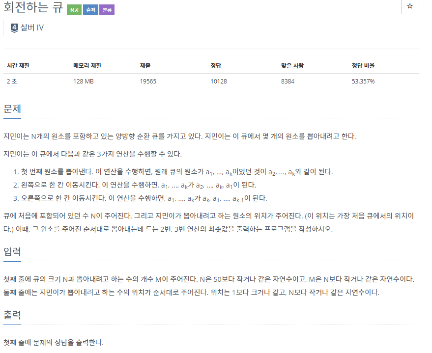
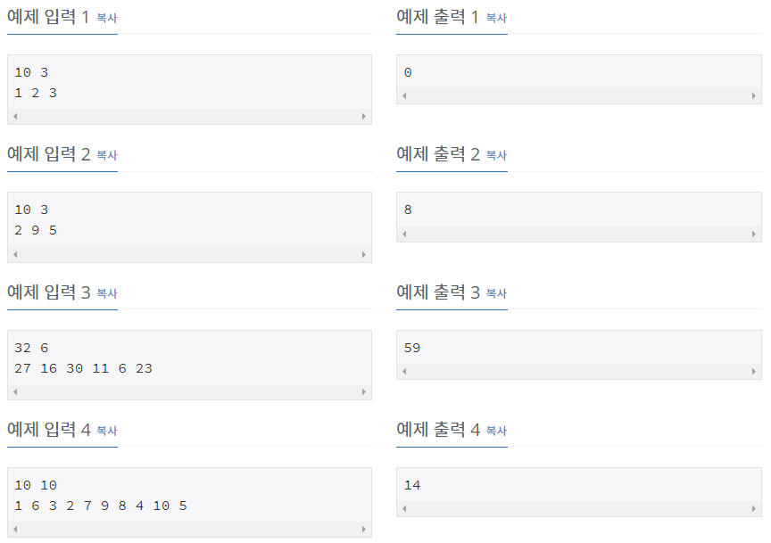

# [[1021] 회전하는 큐](https://www.acmicpc.net/problem/1021)



___
## 🤔접근
___
## 💡풀이
- <b>자료구조 deque</b>를 이용하였다.
	- 찾으려는 number가 주어지면, 먼저 해당 숫자가 위치하는 index를 찾은 다음, 앞에서부터 찾는 게 빠른지, 뒤에서부터 찾는 게 빠른지 판단하였다.
___
## ✍ 피드백
___
## 💻 핵심 코드
```c++
for (int i = 0; i < dq.size(); i++) {
	if (dq.at(i) == num) {
		idx = i;
		break;
	}
}

if (dq.size() - idx > idx) {
	while(dq.front() != num) {
		dq.push_back(dq.front()); 
		dq.pop_front();
		cnt++;
	}
}

else {
	while(dq.front() != num) {
		dq.push_front(dq.back());
		dq.pop_back();
		cnt++;
	}
}
dq.pop_front();
```