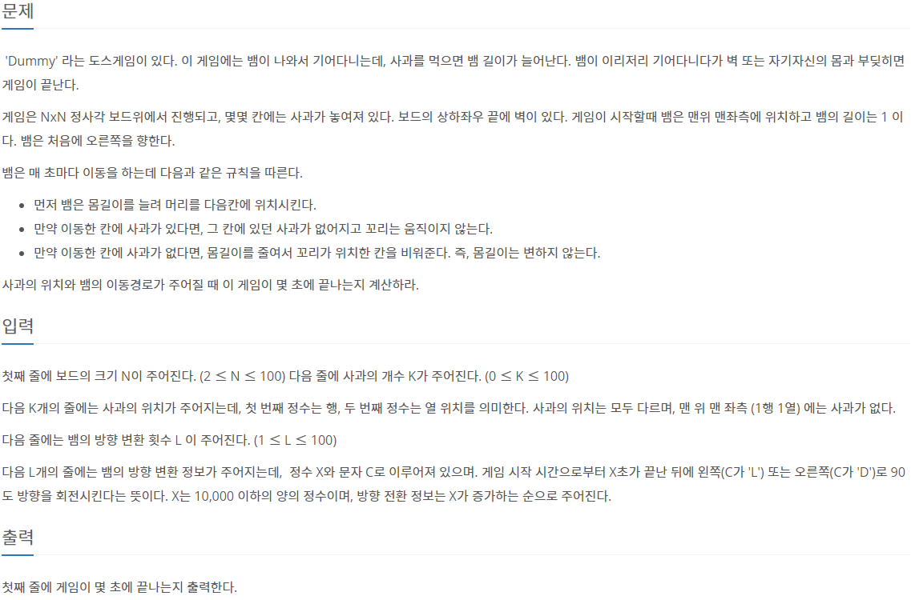
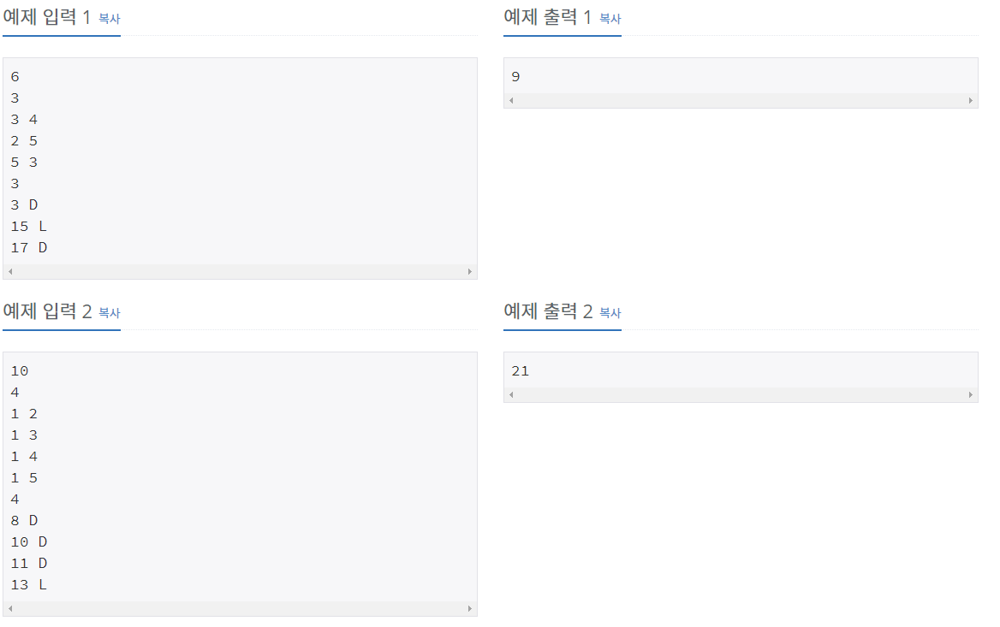

## [[3190] 뱀](https://www.acmicpc.net/problem/3190)



___
## **풀이**
- 자료구조 `덱(Deque)`을 이용하였다.
	- 뱀이 이동할 때 앞부분이 늘어나므로 push_front
	- 뱀이 이동한 자리에 사과가 없다면 뒷부분이 줄어드므로 pop_back
- 뱀이 이동한 자리에 자신의 몸통이나 벽이 존재하면 게임을 종료해야 한다. 
```c++
// 이동한 자리가 벽인 경우, flag on
if (x > N || y > N || x == 0 || y == 0) {
	flag = true;
	break;
}
```
```c++
// 이동한 자리에 사과가 없다면, 뒷부분이 줄어드므로 pop_back
if (apple[x][y] != 1) {
	if (XY != snake.back()) {
		for (auto iter = snake.begin(); iter != snake.end(); ++iter) {
			// 이동한 자리에 몸이 있는 경우, flag on
			if (*iter == make_pair(x, y)) {
				flag = true;
				break;
			}
		}
	}
	if (flag)
		break;
	snake.pop_back();
}
// 뱀이 이동한 자리를 덱에 추가
snake.push_front(make_pair(x, y));
// 이동한 자리에 더 이상 사과가 없음을 표시
apple[x][y] = 0;
```
- 주어진 시간대마다 뱀의 방향을 변환시켜야 한다.
```c++
if (rotate == 'D') {
	// 현재 뱀의 머리가 향하는 방향에 따라 회전 방향 적용
	if (Right) {
		Right = 0;
		Down = 1;
	}
	else if (Left) {
		Left = 0;
		Up = 1;
	}
	else if (Up) {
		Up = 0;
		Right = 1;
	}
	else if (Down) {
		Down = 0;
		Left = 1;
	}
}
else if (rotate == 'L') {
	// 현재 뱀의 머리가 향하는 방향에 따라 회전 방향 적용
	if (Right) {
		Right = 0;
		Up = 1;
	}
	else if (Left) {
		Left = 0;
		Down = 1;
	}
	else if (Up) {
		Up = 0;
		Left = 1;
	}
	else if (Down) {
		Down = 0;
		Right = 1;
	}
}
```
- 방향 회전 처리가 끝나면, 게임이 종료될 때 까지 뱀을 이동시킨다.
```c++
while (!flag) {
	time++;
	pair<int, int> XY = snake.front();
	int x = XY.first + Right - Left;
	int y = XY.second - Up + Down;
	if (x > N || y > N || x == 0 || y == 0) {
		flag = true;
		break;
	}
	if (apple[x][y] != 1) {
		if (XY != snake.back()) {
			for (auto iter = snake.begin(); iter != snake.end(); ++iter) {
				if (*iter == make_pair(x, y)) {
					flag = true;
					break;
				}
			}
		}
		if (flag)
			break;
		snake.pop_back();
	}
	snake.push_front(make_pair(x, y));
	apple[x][y] = 0;
}
```