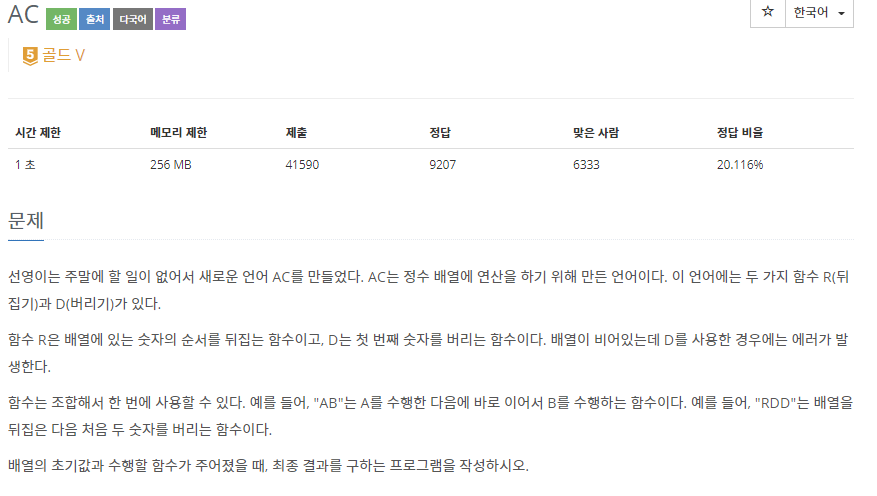
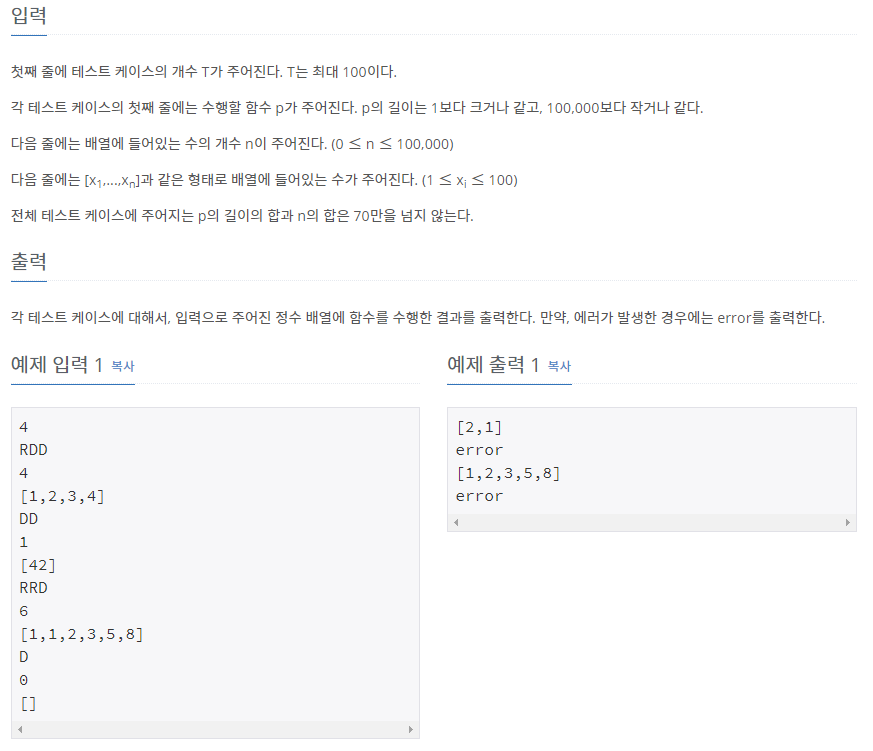

# [[5430] AC](https://www.acmicpc.net/problem/5430)



___
## 🤔접근
1. <b>배열의 순서를 뒤집는 것은 비효율적이다.</b>
	- bool 타입 변수를 이용하여 앞에서부터 or 뒤에서부터 탐색/삭제할지를 정하는 것이 더 효율적이다.
## 💡풀이
- <b>자료구조 deque</b>를 이용하였다.
___
## ✍ 피드백
___
## 💻 핵심 코드
```c++
bool flag = true;
	bool reverse = false;
	for (int i = 0; i < p.size(); i++) {
		if (p.at(i) == 'R') 
			reverse = !reverse;
		else if (p.at(i) == 'D') {
			if (n == 0 || dq.empty()) {
				flag = false;
				break;
			}
			
			if (reverse) 
				dq.pop_back();
			else 
				dq.pop_front();
		}
	}
}
```