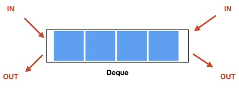

# Deque, 덱


## 개념
- 덱(deque, "deck"과 발음이 같음 ← double-ended queue)은 양쪽 끝에서 삽입과 삭제가 모두 가능한 자료 구조의 한 형태이다.
- 두 개의 포인터를 사용하여, 양쪽에서 삭제와 삽입을 발생 시킬 수 있다. 큐와 스택을 합친 형태로 생각할 수 있다.

## 주요 연산
### 삽입
- 덱의 앞과 뒤에 원소를 삽입한다.
- 시간 복잡도 : `O(1)`
```c++
void push_back(const T& data) {
	Node<T>* newNode = new Node<T>(data);
	if (this->_size == 0)
		this->head = this->tail = newNode;
	else {
		this->tail->next = newNode;
		newNode->prev = this->tail;
		this->tail = newNode;
	}
	this->_size++;
}
```
```c++
void push_front(const T& data) {
	Node<T>* newNode = new Node<T>(data);
	if (this->_size == 0)
		this->head = this->tail = newNode;
	else {
		newNode->next = this->head;
		this->head->prev = newNode;
		this->head = newNode;
	}
	this->_size++;
}
```

### 삭제
- 덱의 앞과 뒤의 원소를 삭제한다.
- 시간 복잡도 : `O(1)`
```c++
void pop_back() {
	if (this->_size == 0)
		return;
	Node<T>* delNode = this->tail;
	if (this->_size > 1) {
		this->tail = this->tail->prev;
		this->tail->next = nullptr;
	}
	delete delNode;
	this->_size--;
}
```
```c++
void pop_front() {
	if (this->_size == 0)
		return;
	Node<T>* delNode = this->head;
	if (this->_size > 1) {
		this->head = this->head->next;
		this->head->prev = nullptr;
	}
	delete delNode;
	this->_size--;
}
```

### 탐색
- 덱의 앞과 뒤의 원소를 탐색한다.
- 시간 복잡도 : `O(1)`
```c++
T front() const {
	return this->head->data;
}
```
```c++
T back() const {
	return this->tail->data;
}
```

## C++ STL
- 헤더 파일
```c++
#include <deque>
```
- 선언
```c++
deque<T> dq;
```
- 반복자
```c++
deque<T>::iterator iter = dq.begin(); // *iter은 해당 iterator의 위치의 원소를 반환한다.
auto iter = dq.begin(); // C++11 타입 자동 추론 auto

dq.begin(); // begin iterator 반환
dq.end(); // end iterator 반환

dq.rbegin(); // end reverse iterator 반환
dq.rend(); // begin reverse iterator 반환

dq.cbegin(); // const 형태의 begin() (C++11)
dq.cend(); // const 형태의 end() (C++11)
dq.crbegin(); // const 형태의 rbegin() (C++11)
dq.crend(); // const형태의 rend() (C++11)
```
- 삽입
```c++
dq.push_front(element); // 맨 앞에 원소 추가
dq.emplace_front(element); // 불필요한 복사 or 이동 작업을 피하면서 새로운 요소 구성 가능(C++11)

dq.push_back(element); // 맨 뒤에 원소 추가
dq.emplace_back(element); // 불필요한 복사 or 이동 작업을 피하면서 새로운 요소 구성 가능(C++11)

dq.insert(iterator, element); // 해당 iterator의 위치의 앞에 원소 추가
dq.emplace(iterator, element); // 불필요한 복사 or 이동 작업을 피하면서 새로운 요소 구성 가능(C++11)
```
- 삭제
```c++
dq.pop_back(); // 맨 뒤의 원소 삭제
dq.erase(iterator); // 해당 iterator의 위치의 원소 삭제
```
- 탐색
```c++
dq.front(); // 맨 앞의 원소 반환
dq.back(); // 맨 뒤의 원소 반환
dq.at(index); // 해당 index의 원소 반환
```
- Capacity
```c++
dq.empty(); // 비어있는지 여부를 bool 타입으로 반환
dq.size(); // 원소의 개수를 반환

dq.max_size(); // 컨테이너가 가질 수 있는 요소의 최대 개수를 반환

// 메모리 사용량을 데이터 사용량만큼으로 딱 맞춰서 조정
dq.shrink_to_fit(); 

dq.resize(a); // 원소 개수를 a개로 조정. 앞에서부터 a개의 원소는 변하지 않음.
// a > n인 경우 맨 뒤에 n-a개 만큼 0 또는 빈 문자를 추가한다.
dq.resize(a, b); // 원소 개수를 a개로 조정.
// 이전에 존재하던 원소 개수를 n이라 하자.
// a > n 인 경우, 맨 뒤에 n-a개 만큼 b를 추가한다.
```
- Modifiers
```c++
dq.clear(); // 모든 원소를 제거한다.
dq.assign(n, element); // 기존 원소들은 모두 제거 후, n개의 element를 할당한다.
// parameter로 list 혹은 iterator를 전달할 수도 있다.

dq1.swap(dq2); // 서로의 원소를 swap한다.
```

