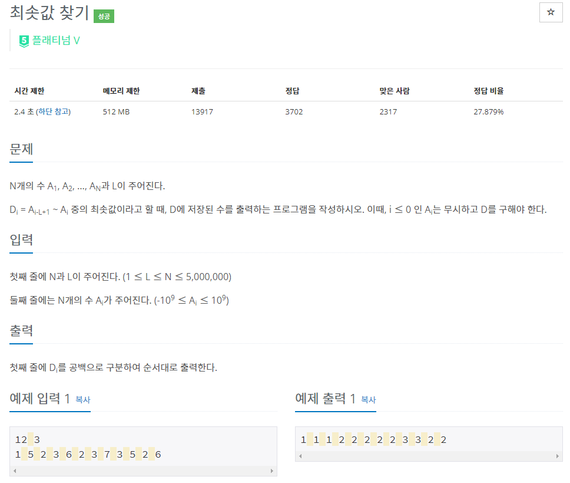

# [[11003] 최솟값 찾기](https://www.acmicpc.net/problem/11003)



___
## 🤔접근
- 입력이 최대 500만개이므로, O(Nlog₂N) 이하의 시간복잡도로 해결해야 한다.
	- 우선 입력이 총 L개라고 한정해보고, L개의 범위 내에서 최솟값을 구하는 최선의 방법은 `우선순위 큐`를 이용하는 것이다.
		- 삽입: O(log₂N)
		- 탐색/삭제: O(1)
	- 입력이 N개일 때는, 현재 top에 존재하는 원소가 L개의 범위 내에 있는지 판별할 필요가 있다.
		- 우선순위 큐에 `(value, index)`를 저장함으로써, L개의 범위 밖에 있다면 pop하는 방식으로 구현해보자.
___
## 💡풀이
- <b>알고리즘 & 자료구조</b>
	- `Priority queue`
___
## ✍ 피드백
___
## 💻 핵심 코드
```c++
int main(){
	...

	priority_queue<pair<int, int>, vector<pair<int, int>>, greater<pair<int, int>>> pq;
	for (int i = 0; i < L; i++) {
		pq.emplace(v[i], i);
		ans[i] = min(pq.top().first, v[i]);
	}

	for (int i = L; i < N; i++) {
		pq.emplace(v[i], i);
		while (pq.top().second <= i - L)
			pq.pop();
		ans[i] = pq.top().first;
	}

	...
}
```