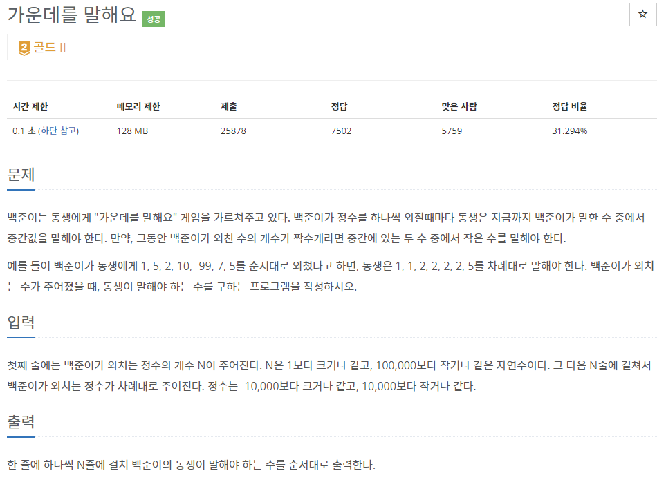
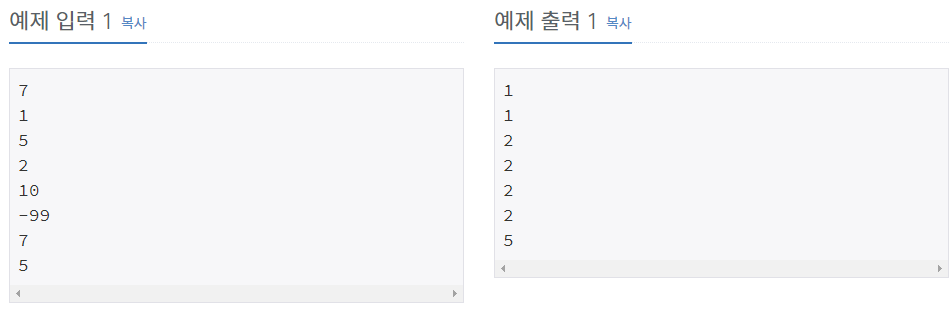

# [[1655] 가운데를 말해요](https://www.acmicpc.net/problem/1655)



___
## 🤔접근
- 아래의 규칙을 만족하도록 구현하자.
	1. maxHeap의 크기는 항상 minHeap의 크기 + 1 이하여야 한다.
	2. maxHeap.top()은 항상 minHeap.top()보다 작아야 한다.
- 위의 규칙을 만족하는 조건 하에, `maxHeap.top()`이 항상 중간값이 된다.
___
## 💡풀이
- <b>알고리즘 & 자료구조</b>
	- `Priority queue`
___
## ✍ 피드백
___
## 💻 핵심 코드
```c++
int main(){
	...

	while (N--) {
		int n;
		cin >> n;
		
		if (minHeap.size() >= maxHeap.size())
			maxHeap.push(n);
		else if (minHeap.size() < maxHeap.size()) 
			minHeap.push(n);
		
		if (!minHeap.empty() && !maxHeap.empty()) {
			if (maxHeap.top() > minHeap.top()) {
				int tmp = minHeap.top();
				minHeap.pop();
				minHeap.push(maxHeap.top());
				maxHeap.pop();
				maxHeap.push(tmp);
			}
		}

	...
}
```