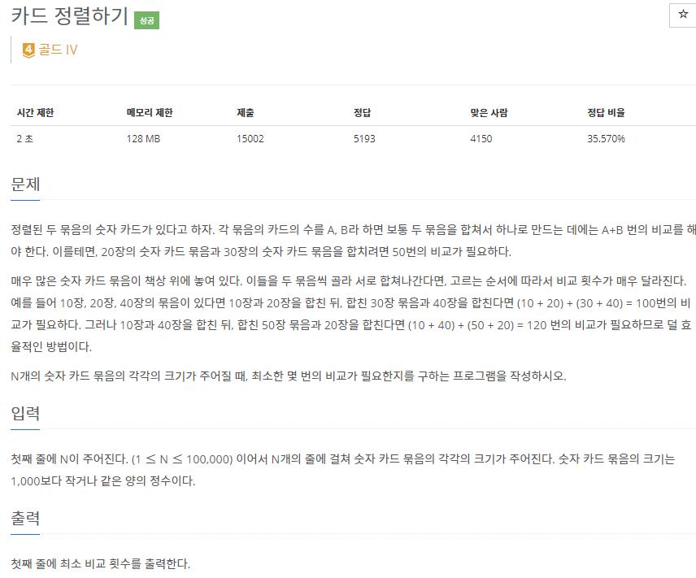
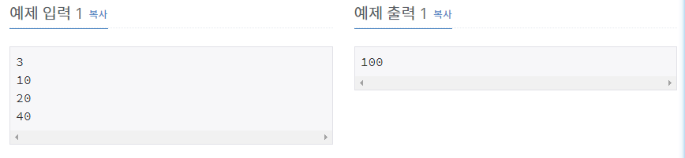

# [[1715] 카드 정렬하기](https://www.acmicpc.net/problem/1715)



___
## 🤔접근
___
## 💡풀이
- <b>탐욕(Greedy) 알고리즘, 우선순위 큐 자료구조</b>을(를) 사용하였다.
	- 한 번 합친 카드 묶음은 한번 더 합치는데 사용될 수 있으며, 매 순간 합칠 때마다 가장 적은 두 숫자 카드 묶음을 합쳐야 최소로 비교하여 모든 카드 묶음을 합칠 수 있다.
	- 우선순위 큐에서 가장 적은 두 카드 묶음을 빼내어 합친 뒤, 다시 삽입하고, 이 과정을 큐에 원소가 하나만 남을 때까지 반복한다.
___
## ✍ 피드백
___
## 💻 핵심 코드
```c++
int main(){
	...
	int ans = 0;
	while (card.size() > 1) {
		int sum = card.top();
		card.pop();
		sum += card.top();
		card.pop();
		card.push(sum);
		ans += sum;
	}
	
	cout << ans;
	...
}
```