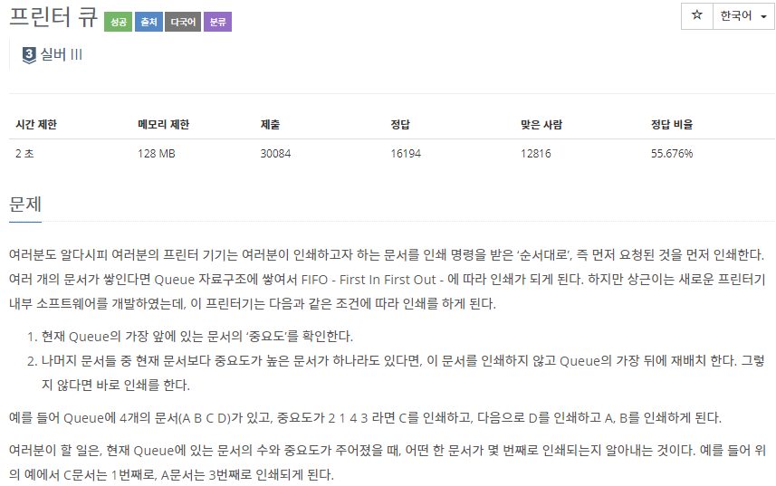
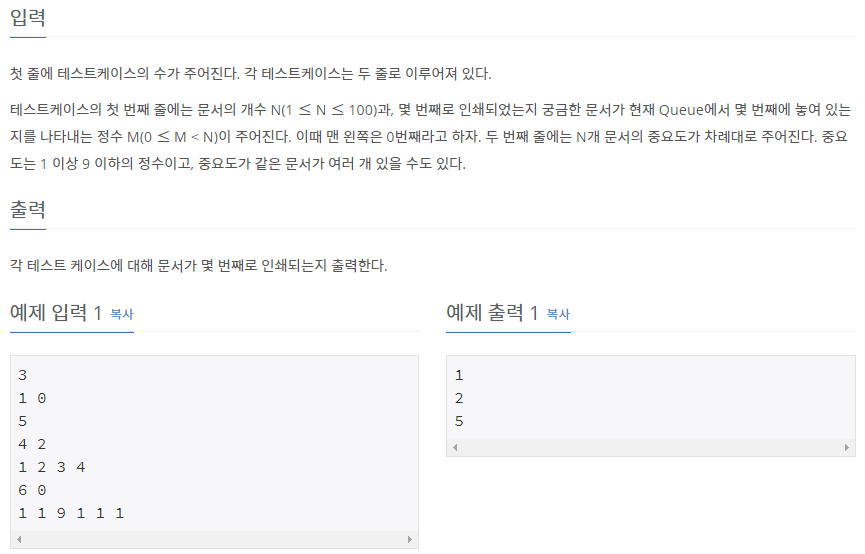

# [[1966] 프린터 큐](https://www.acmicpc.net/problem/1966)



___
## 🤔접근
1. <b>queue에 존재하는 문서 중 가장 높은 우선순위를 실시간으로 알아내야 한다.</b>
	- 단순히 queue만 이용하면 문서를 인쇄할 때 마다 가장 높은 우선순위를 찾아야 하는데, 이는 비효율적이다. O(1)에 알아낼 방법은 없을까?
## 💡풀이
- <b>자료구조 queue, priority queue</b>를 이용하였다.
	- priority queue에 우선순위를 저장함으로써, 현재 가장 높은 우선순위를 O(1)에 알아낼 수 있다.
___
## ✍ 피드백
___
## 💻 핵심 코드
```c++
for (int i = 0; i < M; i++) {
	int n;
	cin >> n;
	pq.push(n);
	q.emplace(n, i); // priority, index
}

int cnt = 1;
while (true) {
	if (q.front().first == pq.top()) { // 맨 앞의 우선순위가 가장 높다면
		if (q.front().second == find) { // 맨 앞의 문서가 찾는 문서라면
			cout << cnt << '\n';
			break;
		}
		pq.pop(); // 인쇄
		cnt++;
	}
	q.push(q.front()); q.pop(); // 맨 뒤로 인쇄물 재배치
}
```