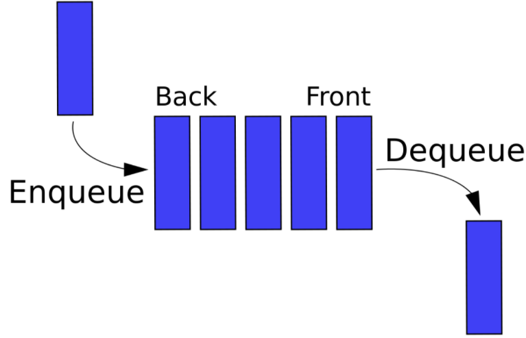

# Queue, 큐


## 개념
- 컴퓨터의 기본적인 자료 구조의 한가지로, 먼저 집어 넣은 데이터가 먼저 나오는 FIFO(First In First Out)구조로 저장하는 형식.

## 종류
- `원형 큐(Circular queue)`
	- 배열로 구현한 선형 큐의 문제점을 보완한 것이 원형 큐이다. 
	- front가 큐의 끝에 닿으면 큐의 맨 앞으로 자료를 보내어 원형으로 연결 하는 방식이다.
- `덱(Deque)`
	- Double-ended Queue의 약자로 양쪽 끝에서 삽입과 삭제가 모두 가능한 자료구조이다.
- `우선순위 큐(Priority queue)`
	- 우선순위가 가장 높은 데이터가 큐에서 먼저 나오는 자료구조이다.

## 주요 연산
### 삽입 연산
- 큐의 맨 뒤에 원소를 추가한다.
- 시간 복잡도 : `O(1)`
```c++
void push(const T& data) {
	Node<T>* newNode = new Node<T>(data);
	if (this->_size == 0)
		this->head = this->tail = newNode;
	else {
		this->tail->next = newNode;
		this->tail = newNode;
	}
	this->_size++;
}
```
### 삭제 연산
- 큐의 맨 앞에 있는 원소를 제거한다.
- 시간 복잡도 : `O(1)`
```c++
void pop() {
	this->delNode = this->head;
	this->head = this->head->next;
	this->_size--;
	delete this->delNode;
}
```
### 탐색 연산
- 큐의 맨 앞이나 뒤에 있는 원소를 탐색한다.
- 시간 복잡도 : `O(1)`
```c++
T front() const {
	return this->head->data;
}
T back() const {
	return this->tail->data;
}
```

## 사용 용도
- 데이터가 입력된 시간 순서대로 처리해야 할 필요가 있는 상황에 이용한다.
- 너비 우선 탐색(BFS, Breadth-First Search) 구현
	- 처리해야 할 노드의 리스트를 저장하는 용도로 큐(Queue)를 사용한다.
	- 노드를 하나 처리할 때마다 해당 노드와 인접한 노드들을 큐에 다시 저장한다.
	- 노드를 접근한 순서대로 처리할 수 있다.
- 캐시(Cache) 구현
- 우선순위가 같은 작업 예약 (인쇄 대기열)
- 선입선출이 필요한 대기열 (티켓 카운터)
- 콜센터 고객 대기시간
- 프린터의 출력 처리
- Windows system의 메시지 처리기
- 프로세스 관리

## C++ STL
- 헤더 파일
```c++
#include <queue>
```
- 선언
```c++
queue<T> q;
```
- 큐의 맨 뒤에 원소 삽입
```c++
q.push(element);
```
- 큐의 맨 앞에 있는 원소 삭제
```c++
q.pop();
```
- 큐의 맨 앞이나 뒤에 있는 원소 반환
```c++
T front_element = q.front();
T back_element = q.back();
```
- 큐에 들어있는 원소 개수를 int 타입으로 반환
```c++
int size = q.size();
```
- 큐이 비어있는지 여부를 bool 타입으로 반환
```c++
bool isempty = q.empty();
```
- 서로 다른 큐간에 원소들 교환
```c++
queue<T> q1;
queue<T> q2;
q1.swap(q2);
```
- C++11 emplace
```c++
queue<int> q;
q.push(make_pair(1, 2));
q.emplace(1, 2); // 불필요한 복사 or 이동 작업을 피하면서 새로운 요소 구성 가능
```