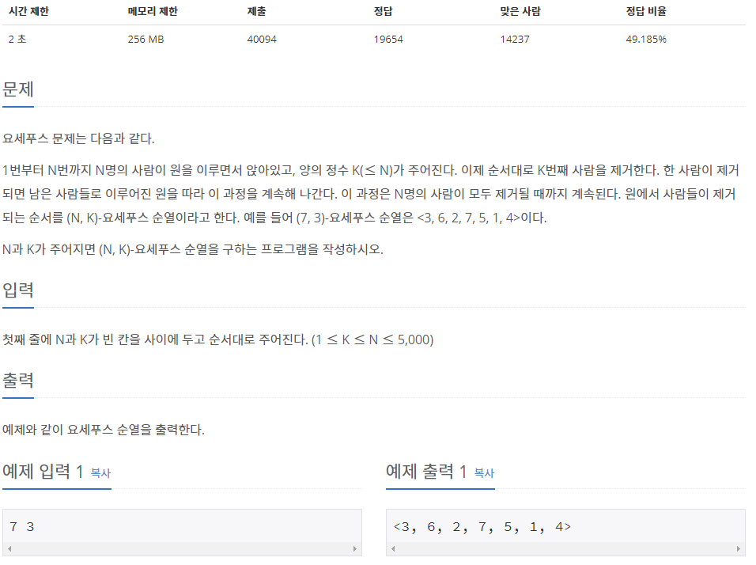

## [[1158] 요세푸스 문제](https://www.acmicpc.net/problem/1158)


___
## **풀이**
- `큐`를 이용하여 아래와 같은 규칙으로 해결하였다.
	- 큐의 front를 push하고 pop하는 과정을 K-1번 반복한다.
	- 다음으로 큐의 front를 출력하고, pop한다.
	- 위의 과정을 큐가 empty 상태가 될 때 까지 반복한다.
```c++
while (!q.empty()) {
	for (int i = 1; i < K; i++) {
		q.push(q.front()); q.pop();
	}
	ans.push(q.front()); q.pop();
}
```