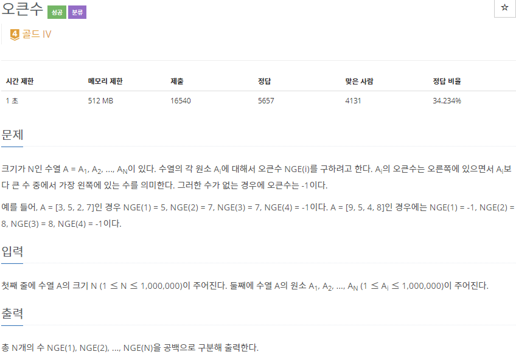
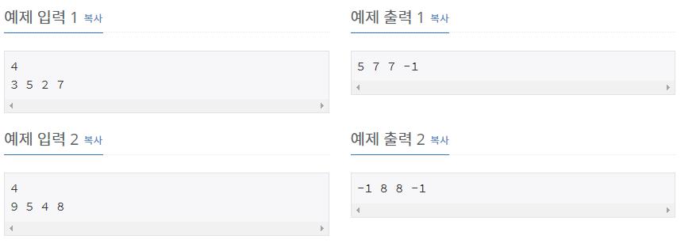

# [[17298] 오큰수](https://www.acmicpc.net/problem/17298)




___
## 💡풀이
- 자료구조 <b>stack</b>을 이용하여 다음과 같이 구현하였다.
	1. 먼저, ans 배열을 M 크기만큼 생성하여 초기값으로 -1을 넣어준다.
	2. 다음으로, 입력을 M번 받으면서 아래와 같은 작업을 수행한다.
		- stack의 top보다 입력값이 크다면 top에 저장된 인덱스를 i라고 했을 떄, ans[i]가 -1이라면 해당 위치에 입력값을 저장한다.
			- ans[i]가 -1이 아니라면, 이미 오큰수가 정해진 경우이다.
		- stack에 입력값과 인덱스를 저장한다.
___
## ✍ 피드백

___
## 💻 핵심 코드
```c++
for (int i = 0; i < M; i++) {
	cin >> n;
	
	while (!s.empty() && n > s.top().first) {
		if (ans[s.top().second] == -1)
			ans[s.top().second] = n;
		s.pop();
	}
	s.emplace(n, i);
}
```