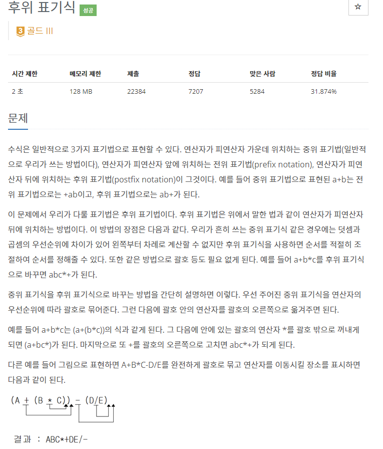
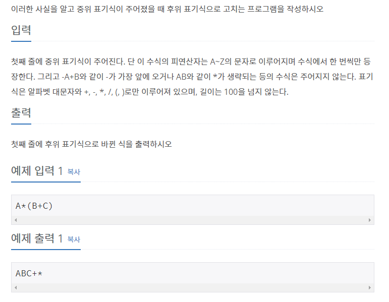

# [[1918] 후위 표기식](https://www.acmicpc.net/problem/1918)




___
## 🤔접근
___
## 💡풀이
- <b>알고리즘 & 자료구조</b>
	- `stack`
- <b>풀이</b>
	- 우선순위 : `*`, `/` `()` > `+`, `-`
	- 중위 표기식을 처음부터 하나씩 탐색하면서 `문자는 그대로 출력`하고, `연산자인 경우 우선순위에 따라 다르게 처리`해주어야 한다.
		- <b>+, -</b> 연산자
			- 우선순위가 가장 낮으므로, stack이 비거나, `(`를 만날 때 까지 모든 연산자를 pop하여 출력한다.
			- 위의 작업이 끝나면, 현재 연산자를 push한다.
		- <b>*, /</b> 연산자
			- 우선순위가 `+`와 `-`보다 높으므로, stack이 비거나, `+`, `-`, `(`를 만날 때 까지 모든 연산자를 pop하여 출력한다.
			- 위의 작업이 끝나면, 현재 연산자를 push한다.
		- <b>열린 괄호</b>
			- push한다.
		- <b>닫힌 괄호</b>
			- stack이 비거나, `(`를 만날 때 까지 모든 연산자를 pop하여 출력한다.
			- 마지막에 `(`는 pop만 해준다.
	- 위의 작업이 모두 끝난 후, stack이 비어있지 않으면, 모든 연산자를 pop하여 출력한다.
___
## ✍ 피드백

___
## 💻 핵심 코드
```c++
int main() {
	...

	for (int i = 0; i < infix.size(); i++) {
		char cur = infix[i];

		if (cur == '+' || cur == '-') {
			while (!s.empty() && s.top() != '(') {
				postfix += s.top();
				s.pop();
			}
			s.push(cur);
		}
		else if (cur == '*' || cur == '/') {
			while (!s.empty() && s.top() != '+' && s.top() != '-' && s.top() != '(') {
				postfix += s.top();
				s.pop();
			}
			s.push(cur);
		}
		else if (cur == '(')
			s.push(cur);
		else if (cur == ')') {
			while (!s.empty() && s.top() != '(') {
				postfix += s.top();
				s.pop();
			}
			s.pop();
		}
		else 
			postfix += cur;
	}
	while (!s.empty()) {
		postfix += s.top();
		s.pop();
	}

	...
} 
```