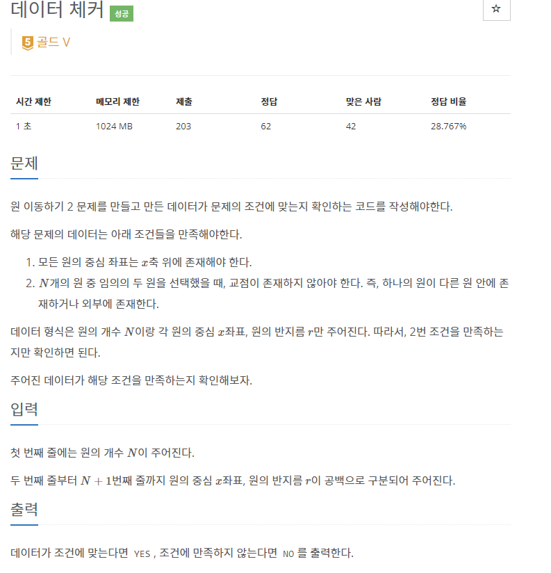
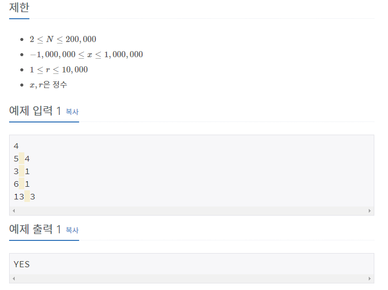

# [[17298] 오큰수](https://www.acmicpc.net/problem/17298)




___
## 🤔접근
- 각 원의 중심에 반지름을 빼고 더한 두 값을 각각 저장하고, 오름차순으로 정렬해서 하나씩 비교해보자.
___
## 💡풀이
- <b>알고리즘 & 자료구조</b>
	- `stack`
- <b>풀이</b>
	- `circle` 배열에 `{중심 - 반지름, 중심 + 반지름}` 값을 대입해주고, 이를 오름차순으로 정렬한다.
	- 앞에서부터 인접한 두 인덱스를 비교했을 때 겹치는 부분이 있으면, 조건에 만족하지 않는다는 뜻이다.
___
## ✍ 피드백

___
## 💻 핵심 코드
```c++
int main() {
	...

	vector<pair<int, int>> circle(N);
	for (int i = 0; i < N; i++) {
		int x, r;
		cin >> x >> r;
		circle[i] = {x - r, x + r};
	}
	sort(circle.begin(), circle.end());

	bool flag = true;
	auto prev = circle.front();
	for (int i = 1; i < N; i++) {
		auto cur = circle[i];
		if (prev.second >= cur.first && prev.second <= cur.second) {
			flag = false;
			break;
		}
		prev = cur;
	}

	...
} 
```