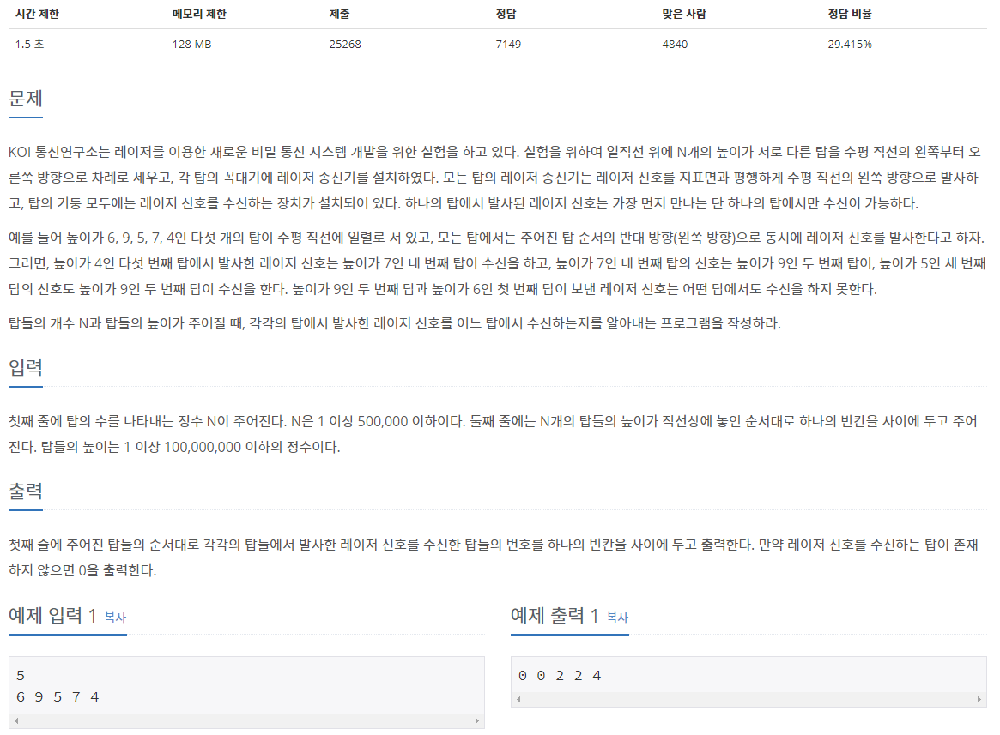

## [[2493] 탑](https://www.acmicpc.net/problem/2493)


___
## **풀이**
- `index와 높이를 담는 stack`을 이용하여 해결하였다.
- 맨 마지막 tower부터 거꾸로 방문하면서 아래와 같은 규칙으로 처리하였다.
	- 만약, 현재 tower가 왼쪽 tower보다 높이가 작거나 같다면,
		- answer 배열의 `현재 tower의 index`에 왼쪽 tower의 index를 저장한다.
		- `tmp 스택`이 비어있지 않고, `tmp 스택의 top`이 왼쪽 tower보다 높이가 작거나 같다면(`반복문`),
			- answer 배열의 `tmp 스택의 top의 index`에 왼쪽 tower의 index를 저장한다.
	- 만약, 현재 tower가 왼쪽 tower보다 높이가 크다면,
		- `tmp 스택`에 현재 tower의 정보를 push한다.
			> `tmp 스택`에는 `top의 높이보다 항상 작은 tower만 push`된다.
	```c++
	if (s.top().second >= top.second) {
		answer[top.first - 1] = s.top().first;
		
		while (!tmp.empty() && s.top().second >= tmp.top().second) {
			answer[tmp.top().first - 1] = s.top().first;
			tmp.pop();
		}
	}
	else 
		tmp.push(top);	
	```