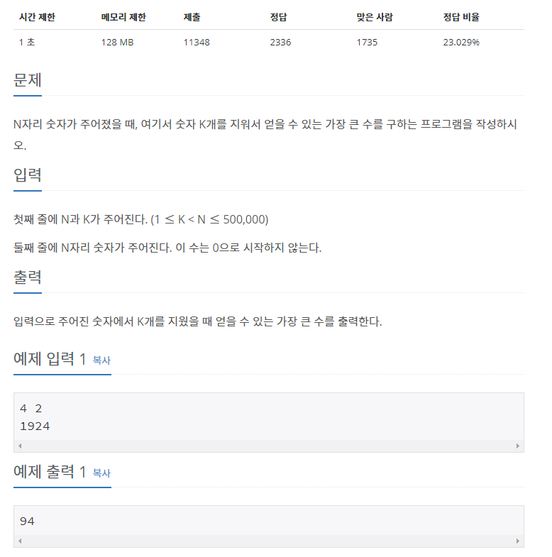

## [[2812] 크게 만들기](https://www.acmicpc.net/problem/2812)


___
## **풀이**
- 최대 `50만 자리의 숫자`를 입력 받아야 하므로, 입력을 `문자열`로 받아야 한다.
- 문자열 왼쪽부터 하나씩 스택에 push한다.
	- 현재 문자가 스택의 top보다 크다면, pop하고 K를 1 감소시킨다.
		- K가 1 이상이고, 현재 문자가 스택의 top보다 크다면 위 과정을 반복한다.
		```c++
		for (int i = 0; i < N; i++) {
				while (K > 0 && !s.empty() && s.top() < number[i]) {
					s.pop();
					K--;
				}
				s.push(number[i]);
			}
		```
	- 문자열을 모두 처리한 이후에도 K가 1 이상이라면, K가 0이 될 때까지 pop하고 K를 1 감소시킨다.
	```c++
	while (K > 0 && !s.empty()) {
		s.pop();
		K--;
	}
	```
	- 최종적으로 스택에서 문자를 하나씩 빼내어, 순서를 뒤집은 다음 출력한다.
	```c++
	reverse(answer.begin(), answer.end());
	cout << answer;
	```
