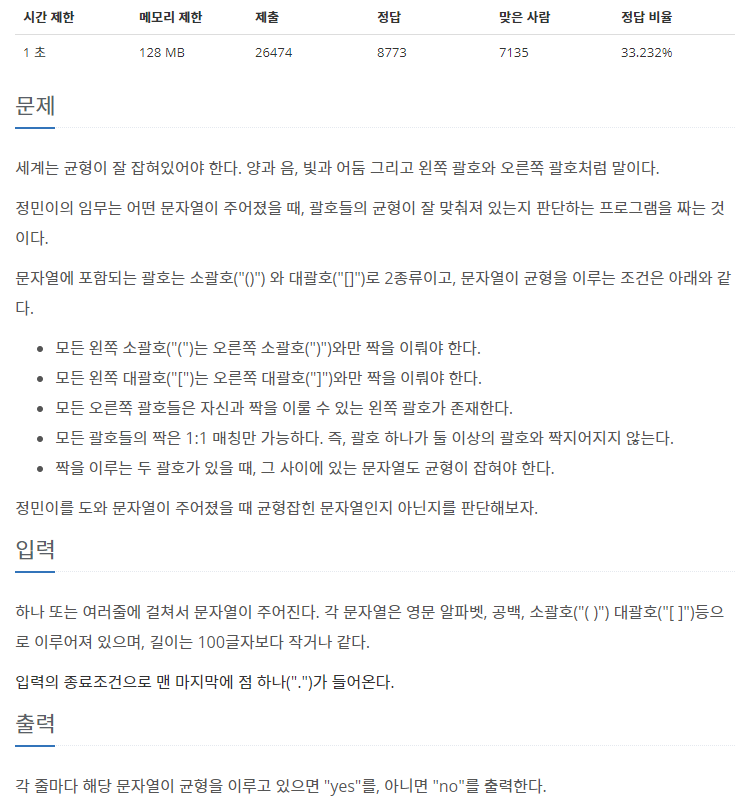

## **[[4949] 균형잡힌 세상](https://www.acmicpc.net/problem/4949)**
___


## **풀이**
___
- 문자열의 문자 하나하나를 탐색하면서, 다음과 같은 규칙으로 문자를 처리한다.
    1. 문자가 여는 괄호인 경우 : 스택에 push
    2. 문자가 닫는 괄호인 경우 
        - 스택이 비어있는 경우, *"no"*
        - 스택의 top에 짝이 맞는 여는 괄호가 없는 경우, *"no"*
        - 스택의 top에 짝이 맞는 여는 괄호가 있는 경우, 스택에서 pop
- 최종적으로, 스택이 비어있는 경우, *"yes"* 를 출력한다. 

- 추가로 **C++** 의 경우, 한 줄씩 입력을 받기 위해서는 아래와 같이 *getline* 함수를 사용하면 된다.
```c++
#include <string>
string input;
getline(std::cin, input);
``` 

- **Java** 의 경우, 입출력을 향상시키기 위해 아래와 같이 사용하는 편이 좋다.
```java
import java.io.InputStreamReader;
import java.io.OutputStreamWriter;
BufferedReader br = new BufferedReader(new InputStreamReader(System.in));
BufferedWriter bw = new BufferedWriter(new OutputStreamWriter(System.out));
String input = br.readLine();
bw.write("yes\n");
bw.flush();
br.close();
bw.close();
```