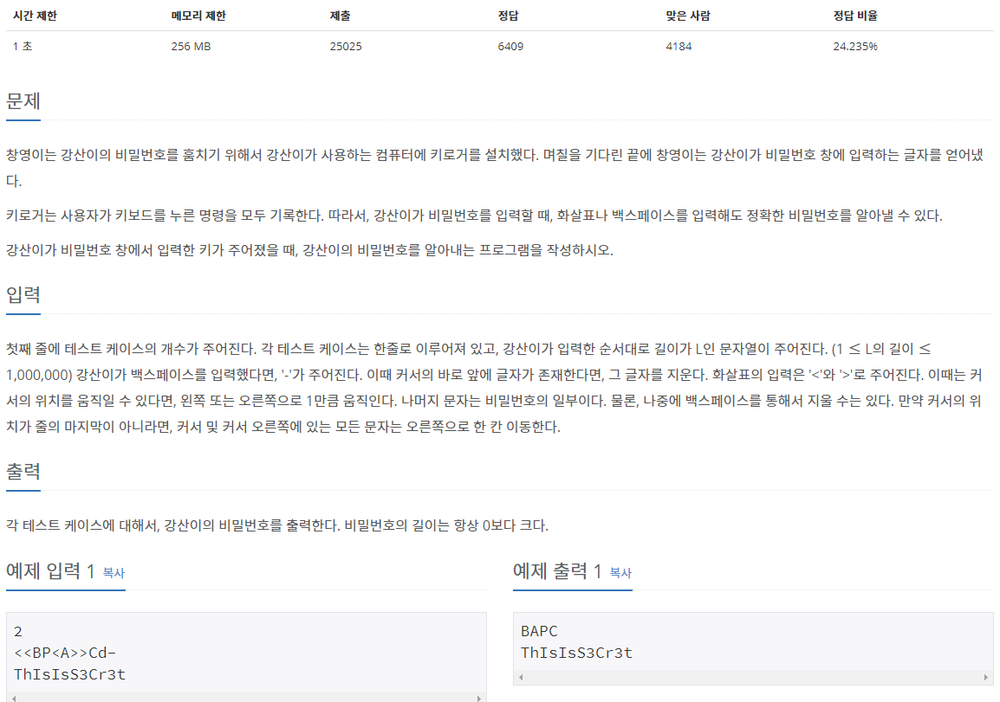

## **[[5397] 키로거](https://www.acmicpc.net/problem/5397)**


___
## **풀이**
- `left와 right stack`을 생성하여, 아래와 같은 규칙으로 구현하였다.
	1. 입력이 `<`인 경우
		- left stack이 비어있지 않다면, right stack에 left top을 push하고, left pop.
		```c++
		if (c == '<') {
			if (!left.empty()) {
				right.push(left.top());
				left.pop();
			}
		}
		```
	2. 입력이 `>`인 경우
		- right stack이 비어있지 않다면, left stack에 right top을 push하고, right pop.
		```c++
		else if (c == '>') {
			if (!right.empty()) {
				left.push(right.top());
				right.pop();
			}
		}
		```
	3. 입력이 `-`인 경우
		- left stack이 비어있지 않다면, left pop.
		```c++
		else if (c == '-') {
			if (!left.empty())
				left.pop();
		}
		```
	4. 그 외 입력의 경우
		- left stack에 입력 문자 push
		```c++
		else 
			left.push(c);
		```
	5. 모든 문자에 대해 처리가 끝난 이후
		- left stack의 모든 원소를 right stack에 차례대로 push한 이후, right stack에서 모든 문자를 출력
		```c++
		while (!left.empty()) {
			right.push(left.top());
			left.pop();
		}

		while (!right.empty()) {
			cout << right.top();
			right.pop();
		}
		```