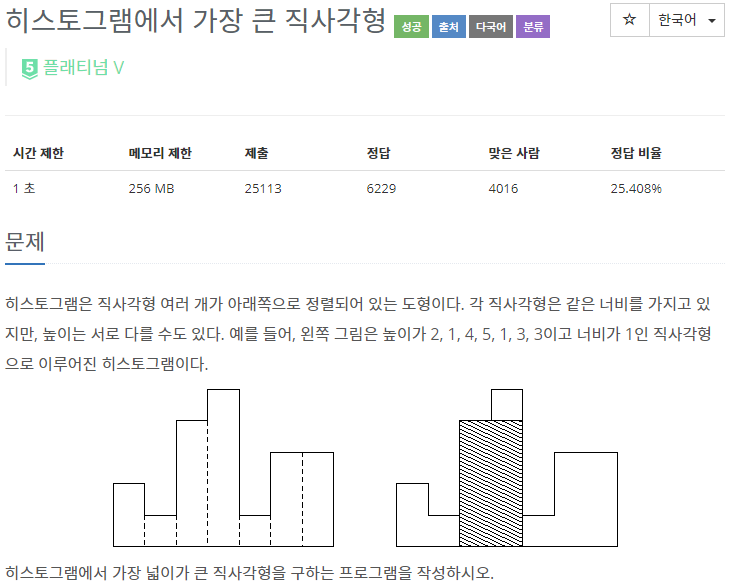
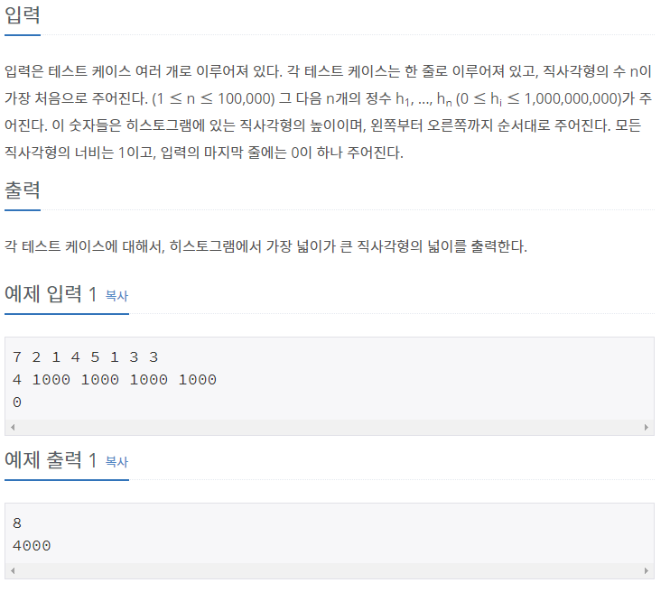

## **[[6549] 히스토그램에서 가장 큰 직사각형](https://www.acmicpc.net/problem/6549)**


___
## **풀이**
- 아래와 같은 규칙으로 구현하였다.
    1. 스택이 비어있거나, 현재 index의 직사각형이 스택의 top보다 높이가 같거나 큰 직사각형이면 push한다.
        ```c++
	    if (s.empty() || (!s.empty() && s.top().first <= rec))
		    s.push(make_pair(rec, i));
        ```    
    2. 현재 index의 직사각형이 스택의 top보다 높이가 작은 직사각형이면 pop한다.
        - 이 때, 스택의 top의 높이가 현재 index의 직사각형의 높이보다 작을 때 까지 반복하여 pop한다.
        - pop할 때마다, height를 pop한 직사각형의 높이로 갱신시킨다.
        - width는 `현재 직사각형의 index - top의 index - 1`으로 갱신한다.
            - 이 때, 1을 빼주는 이유는 pop을 먼저 하고 나서 top의 index를 참조하기 때문이다.
        - 넓이를 계산했을 때, area보다 크다면 갱신시킨다.
        - 마지막으로 현재 index의 직사각형을 push한다.
        ```c++
        else if (!s.empty() && s.top().first > rec) {
			while (!s.empty() && s.top().first >= rec) {
				height = s.top().first;
				s.pop();

				if (s.empty())
					width = i;
				else
					width = i - s.top().second - 1;

				if (area < width * height)
					area = width * height;
			}
			s.push(make_pair(rec, i));
		}
        ```
    3. 스택이 empty가 아닌 경우, 처리되지 않은 직사각형들을 따로 처리하는 코드가 필요하다.
        - 스택이 empty 상태가 될 때 까지 pop하면서, 2 번째 규칙과 동일하게 구현하였다.
        ```c++
        while (!s.empty()) {
			height = s.top().first;
			s.pop();

			if (s.empty())
				width = n;
			else
				width = n - s.top().second - 1;

			if (area < width * height)
				area = width * height;
		}
        ```
- Time complexity : O(n)
