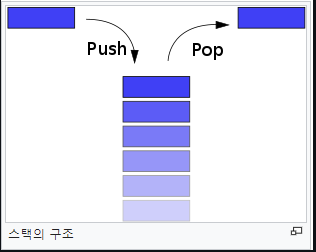

# Stack, 스택


## 개념
- 한 쪽 끝에서만 자료를 넣거나 뺄 수 있는 선형 구조 (LIFO - Last In First Out)

## 주요 연산
### 삽입 연산
- 스택 상단에 원소를 추가한다.
- 시간 복잡도 : `O(1)`
```c++
void push(const T& data) {
	Node<T>* newNode = new Node<T>(data);
	if (this->_size == 0)
		this->head = newNode;
	else {
		newNode->next = this->head;
		this->head = newNode;
	}
	this->_size++;
}
```
### 삭제 연산
- 스택 상단에 있는 원소를 제거한다.
- 시간 복잡도 : `O(1)`
```c++
void pop() {
	this->delNode = this->head;
	this->head = this->head->next;
	this->_size--;
	delete this->delNode;
}
```
### 탐색 연산
- 스택 상단에 있는 원소를 탐색한다.
- 시간 복잡도 : `O(1)`
```c++
T top() const {
	return this->head->data;
}
```

## 사용 용도
- 재귀 알고리즘
	- 재귀적으로 함수를 호출해야 하는 경우에 임시 데이터를 스택에 넣어준다.
	- 재귀함수를 빠져 나와 퇴각 검색(backtrack)을 할 때는 스택에 넣어 두었던 임시데이터를 빼 줘야 한다.
	- 스택은 이런 일련의 행위를 직관적으로 가능하게 해 준다.
	- 또한 스택은 재귀 알고리즘을 반복적 형태(iterative)를 통해서 구현할 수 있게해준다.
- 웹 브라우저 방문기록 (뒤로가기)
- 실행 취소 (undo)
- 역순 문자열 만들기
- 수식의 괄호 검사 (연산자 우선순위 표현을 위한 괄호 검사)
	> ex) 올바른 괄호 문자열(VPS, Valid Parenthesis String) 판단하기
- 후위 표기법 계산

## C++ STL
- 헤더 파일
```c++
#include <stack>
```
- 선언
```c++
stack<T> s;
```
- 스택 상단에 원소 삽입
```c++
s.push(element);
```
- 스택 상단에 있는 원소 삭제
```c++
s.pop();
```
- 스택 상단에 있는 원소 반환
```c++
T element = s.top();
```
- 스택에 들어있는 원소 개수를 int 타입으로 반환
```c++
int size = s.size();
```
- 스택이 비어있는지 여부를 bool 타입으로 반환
```c++
bool isempty = s.empty();
```
- 서로 다른 스택간에 원소들 교환
```c++
stack<T> s1;
stack<T> s2;
s1.swap(s2);
```
- C++11 emplace
```c++
stack<int> s;
s.push(make_pair(1, 2));
s.emplace(1, 2); // 불필요한 복사 or 이동 작업을 피하면서 새로운 요소 구성 가능
```