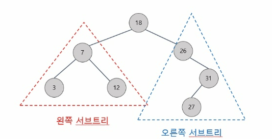
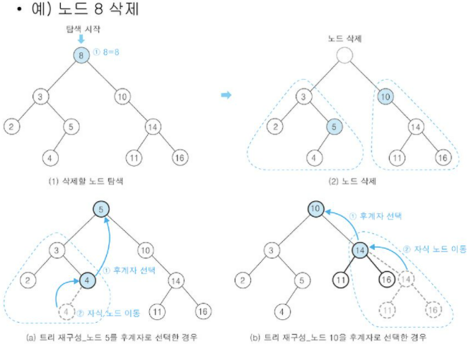

# Binary Search Tree, 이진 탐색 트리

## 개념
이진 트리 기반의 탐색을 위한 자료구조이며, 아래의 조건을 반드시 만족해야 한다.<br>
1. 모든 노드의 key 는 `유일`하다.
2. 왼쪽 서브 트리의 keys 는 root 의 key 보다 작다.
3. 오른쪽 서브 트리의 keys 는 root 의 key 보다 크다.
4. 왼쪽과 오른쪽 서브 트리도 이진 탐색 트리이다.<br>


___
## 탐색 연산
- root 노드부터 시작해서, 탐색하려는 key 가 root 노드의 key 보다 작으면 왼쪽, 반대는 오른쪽으로 이동하면서 해당 key 를 찾을 때 까지 아래로 이동한다.
- 시간 복잡도 : `O(log N)`
```c++
Node<T>* find(const T& data) const {
		queue<Node<T>*> q;
		Node<T>* curNode;
		q.push(this->_root);

		while (!q.empty()) {
			curNode = q.front(); q.pop();
			if (curNode->data == data) return curNode;

			if (curNode->data > data) {
				if (curNode->left != nullptr)
					q.push(curNode->left);
			}
			else if (curNode->data < data) {
				if (curNode->right != nullptr)
					q.push(curNode->right);
			}
		}

		return nullptr;
	}
```
___
## 삽입 연산
- 먼저 삽입하려는 key 를 탐색 연산을 통해 실패하는 위치를 찾고, 그 위치에 key 를 삽입한다.
- 시간 복잡도 : `O(log N)`
```c++
void insert(const T& data) {
		Node<T>* newNode = new Node<T>(data);
		if (this->_size == 0)
			this->_root = newNode;
		else {
			Node<T>* curNode = this->_root;

			while (true) {
				if (curNode->data > data) {
					if (curNode->left) 
						curNode = curNode->left;
					else {
						curNode->left = newNode;
						curNode->left->par = curNode;
						break;
					}
				}
				else if (curNode->data < data) {
					if (curNode->right) 
						curNode = curNode->right;			
					else {
						curNode->right = newNode;
						curNode->right->par = curNode;
						break;
					}
				}
			}
		}
		this->_size++;
	}
```
___
## 삭제 연산
- 다음과 같이 3 가지 경우를 고려하여 구현해야 한다.
    1. 삭제하려는 노드가 `단말노드`인 경우
    2. 삭제하려는 노드가 `한 개의 서브트리`만 가지는 경우
    3. 삭제하려는 노드가 `두 개의 서브트리`를 가지는 경우
- 위의 판단 근거는 `트리의 변동성을 최소화함`에 있다.
- 시간 복잡도 : `O(log N)`<br><br>
- 삭제하려는 노드가 `단말노드`인 경우
    - 해당 노드를 탐색연산을 통해 찾은 뒤, 부모노드와 연결을 해제하고 삭제하려는 노드의 메모리를 반환시켜준다.
    ```c++
    else if (!delNode->left && !delNode->right) {
			if (delNode->par->left == delNode)
				delNode->par->left = nullptr;
			else if (delNode->par->right == delNode)
				delNode->par->right = nullptr;
		}
    ```
- 삭제하려는 노드가 `한 개의 서브트리`만 가지는 경우
    - 해당 노드를 탐색연산을 통해 찾은 뒤, 삭제하려는 노드의 자식노드와 삭제하려는 노드의 부모노드를 서로 연결시킨다. 
    - 최종적으로 삭제하려는 노드의 연결을 각각 해제하고 메모리를 반환시켜준다.
    - 삭제하려는 노드가 왼쪽 or 오른쪽 서브트리 중 어느 것을 가지고 있는지 구분하여 각각 구현해주어야 한다.
    ```c++
    else if (delNode->left && !delNode->right) {
			if (delNode->par->left == delNode) {
				delNode->par->left = delNode->left;
				delNode->left->par = delNode->par;
			}
			else if (delNode->par->right == delNode) {
				delNode->par->right = delNode->left;
				delNode->left->par = delNode->par;
			}
		}
		else if (!delNode->left && delNode->right) {
			if (delNode->par->left == delNode) {
				delNode->par->left = delNode->right;
				delNode->right->par = delNode->par;
			}
			else if (delNode->par->right == delNode) {
				delNode->par->right = delNode->right;
				delNode->right->par = delNode->par;
			}
		}
    ```
- 삭제하려는 노드가 `두 개의 서브트리`를 가지는 경우<br><br>

    - 두 가지 방법이 있지만, 본인은 아래의 방법을 선호한다.
    - 먼저 삭제하려는 노드의 `왼쪽 서브트리의 가장 맨 오른쪽 자식노드`를 찾는다.
    - 다음으로 삭제하려는 노드와 위에서 찾은 노드를 바꿔치기하여 각각 연결여부를 조정해준다.
    - 이 때, 삭제하려는 노드가 부모노드의 왼쪽 or 오른쪽 자식노드 중 어떤 것인지를 알아야하기에 각각 구현 해주어야 한다.
    - 추가로, `왼쪽 서브트리의 가장 맨 오른쪽 자식노드`의 왼쪽 서브트리가 존재할 수도 있으므로 해당 서브트리를 `왼쪽 서브트리의 가장 맨 오른쪽 자식노드`의 원래 자리로 이동시켜주어야 한다.
        > 이는 `curNode->par->right = curNode->left;` 에 해당한다.
    ```c++
    if (delNode->left && delNode->right) {
			Node<T>* curNode = delNode->left;

			while (curNode->right) {
				curNode = curNode->right;
			}
			curNode->par->right = curNode->left;

			curNode->par = delNode->par;
			if (curNode->par->left == delNode) 
				curNode->par->left = curNode;			
			else if (curNode->par->right == delNode) 
				curNode->par->right = curNode;	

			curNode->left = delNode->left;
			delNode->left->par = curNode;
			curNode->right = delNode->right;
			delNode->right->par = curNode;
		}
    ```
