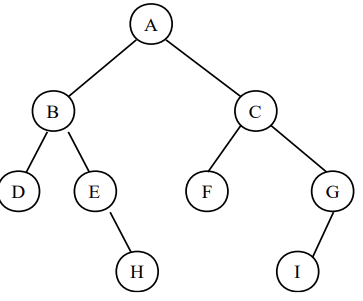
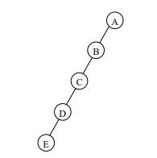
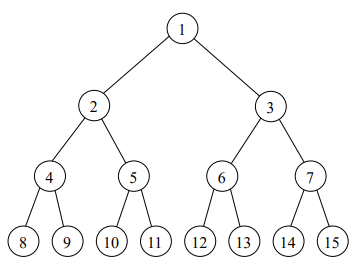
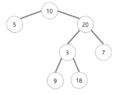

# Binary Tree, 이진 트리

## 개념
각각의 노드가 `최대 두 개의 자식 노드`를 가지는 트리 자료 구조이다.  

  
## 종류
1. **편향(skewed)** 이진 트리 
    - 한 쪽으로 편향되어 연결리스트 형태로 생성된 트리. 

2. **포화(perfect)** 이진 트리 
    - 높이가 h 일 때, `최대 노드의 수는 2^(h+1)-1 개` 이다.
    - 이 때, 이진 트리에서 `최대 노드의 수를 만족`하는 트리를 `포화(perfect) 이진 트리`라고 한다.

3. **완전(complete)** 이진 트리 
    - 높이가 h 인 트리에서 노드 수가 n 이고, 각 노드의 레벨 순서에 따라 노드 번호를 붙였다고 해보자.
    - 이 때, 각 노드의 번호 위치가 포화 이진 트리의 1번부터 n번 노드의 위치와 모두 일치하는 트리를 `완전(complete) 이진 트리`라고 한다. 

4. **정(full)** 이진트리 
    - 모든 노드가 `자식노드를 0 or 2 개만` 갖는 트리. 
