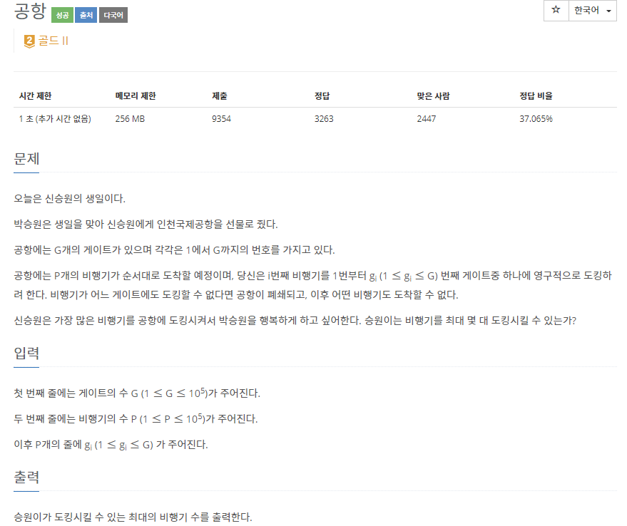
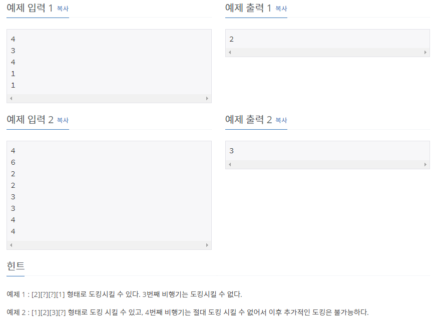

# [[10775] 공항](https://www.acmicpc.net/problem/10775)



___
## 🤔접근
- 예를 들어 g가 3이면, 1~3번 게이트 중 아무 곳이나 도킹할 수 있다.
	- 3번 게이트에 먼저 도킹을 하면, 이후의 입력(g = 3)은 1~2번 게이트 중 한 곳을 선택해야 한다.
	- 또한, `내림차순`으로 선택해야 비행기를 최대로 도킹시킬 수 있다.
		- g = 3일 때, 1번 게이트에 도킹해버리면, 다음 입력(g = 1)에서 공항이 폐쇄되기 떄문이다.
	- 따라서, g -> g - 1 -> g - 2 -> ... -> 0 순서대로 도킹하도록 약속하자.
- 만약, g = 3을 처리한 이후 다음 입력이 g = 2라면, 3번 게이트에 대한 처리도 해주어야 한다.
	- 위에서 3번 게이트에 도킹한 후, 다음 입력이 g = 3일 때 2번 게이트를 선택하도록 약속하였다.
	- 그러나, 3번 게이트에 도킹한 후, 다음 입력이 g = 2일 때 2번 게이트를 선택하면 두 번 처리가 필요하다.
		1. 다음 입력이 g = 2일 때, 1번 게이트로 유도
		2. 다음 입력이 g = 3일 때, 2번 게이트에 도킹이 되어 있으므로, 1번 게이트로 유도
	- 위와 같이 연쇄적으로 처리가 필요하다.
	- 그렇다면, g번 게이트에 도킹한 이후 g는 g - 1을 가리키게 하면 어떨까?
		- g - 1번 게이트에 도킹한 이후 g - 1은 g - 2를 가리키며, g도 g - 1번을 건너 g - 2번을 가리키게 된다.
		- 즉, 각 노드가 부모 노드에 대한 포인터 정보를 갖는 자료구조를 이용하면 된다.
___
## 💡풀이
- <B>알고리즘 & 자료구조</B>
	- Disjoint Set(Union-find)
- <b>구현</b>
	- 각 입력(g)이 가리키는 게이트가 0번일 때, 비행기가 어느 게이트에도 도킹할 수 없는 경우이다.
	- 위 경우가 아니라면, g가 가리키는 게이트(target)가 target - 1을 가리키도록 하고, 도킹시킨 비행기의 수(ans)를 1 증가시킨다.
___
## ✍ 피드백
___
## 💻 핵심 코드
```c++
int main(){
	...
	for (int i = 1; i <= P; i++) {
		int target = find(g[i]);
		if (target == 0)
			break;

		merge(target, target - 1);
		ans++;
	}
	...
}
```