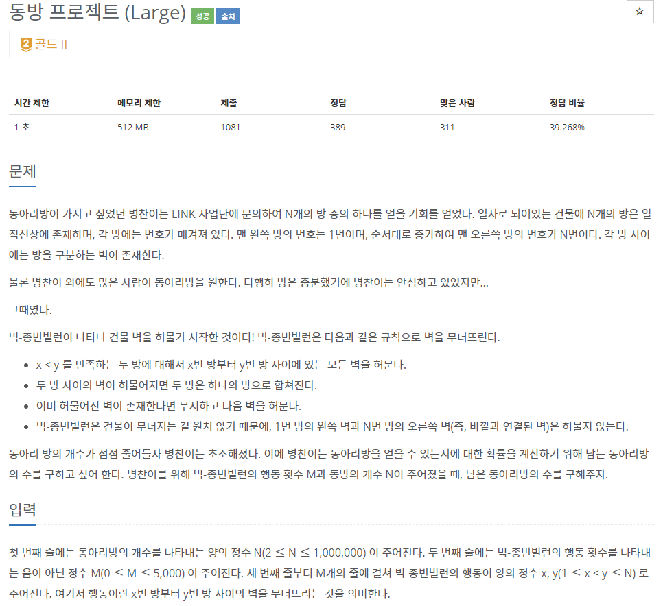
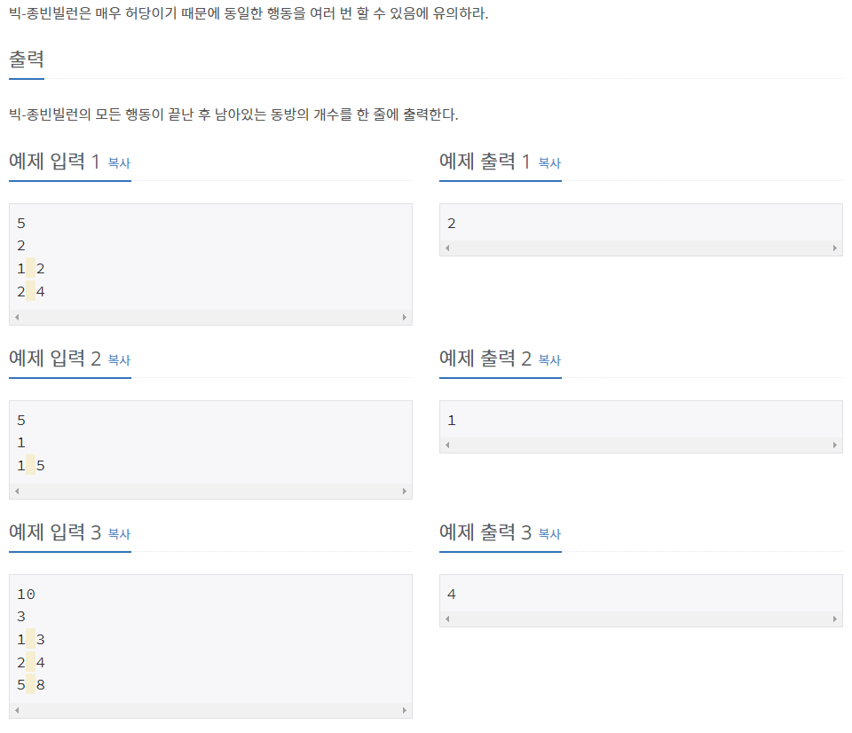

# [[14595] 동방 프로젝트 (Large)](https://www.acmicpc.net/problem/14595)



___
## 🤔접근
- 허무는 벽끼리 같은 집합으로 묶은 후, 총 동방의 개수를 구하자.
	- N이 최대 1e6이므로, 중복으로 허무는 부분을 최소화해야 한다.
___
## 💡풀이
- <B>알고리즘 & 자료구조</B>
	- `Disjoint Set(Union-find)`
	- `누적 합`
- <b>구현</b>
	- 처음 ans를 동방의 총 개수를 저장한 후, merge마다 1씩 감소시키면 최종 동방의 개수를 구할 수 있다.
	- 또한, 동방을 허무는 범위를 오름차순으로 정렬하고, 중복되는 부분을 합치면서 merge 함수를 진행해야 시간초과를 피할 수 있다.
___
## ✍ 피드백
___
## 💻 핵심 코드
```c++
int find(int u) {
	if (u == par[u])
		return u;

	return par[u] = find(par[u]);
}

void merge(int u, int v) {
	u = find(u);
	v = find(v);

	if (u == v)
		return;

	if (_rank[u] < _rank[v])
		swap(u, v);

	ans--;
	par[v] = u;

	if (_rank[u] == _rank[v])
		_rank[u]++;
}

int main() {
	...

	vector<pair<int, int>> pos(M);
	for (int i = 0; i < M; i++) {
		int u, v;
		cin >> u >> v;
		pos[i] = {u, v};
	}

	if (M) {
		sort(pos.begin(), pos.end());
		auto cur = pos.front();

		for (int i = 0; i < M; i++) {
			if (pos[i].first <= cur.second) 
				cur.second = max(cur.second, pos[i].second);
			else {
				for (int j = cur.first; j < cur.second; j++)
					merge(j, j + 1);
				cur = pos[i];
			}
		}
		for (int j = cur.first; j < cur.second; j++)
			merge(j, j + 1);
	}

	...
}
```