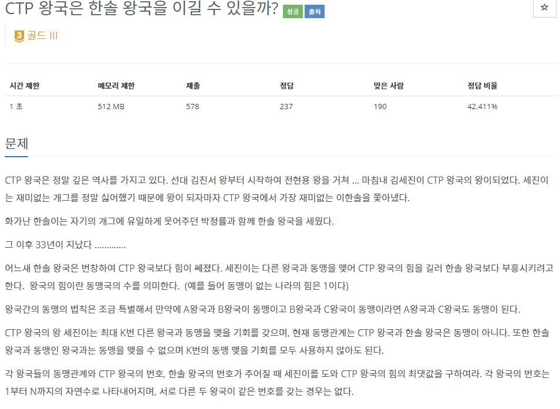
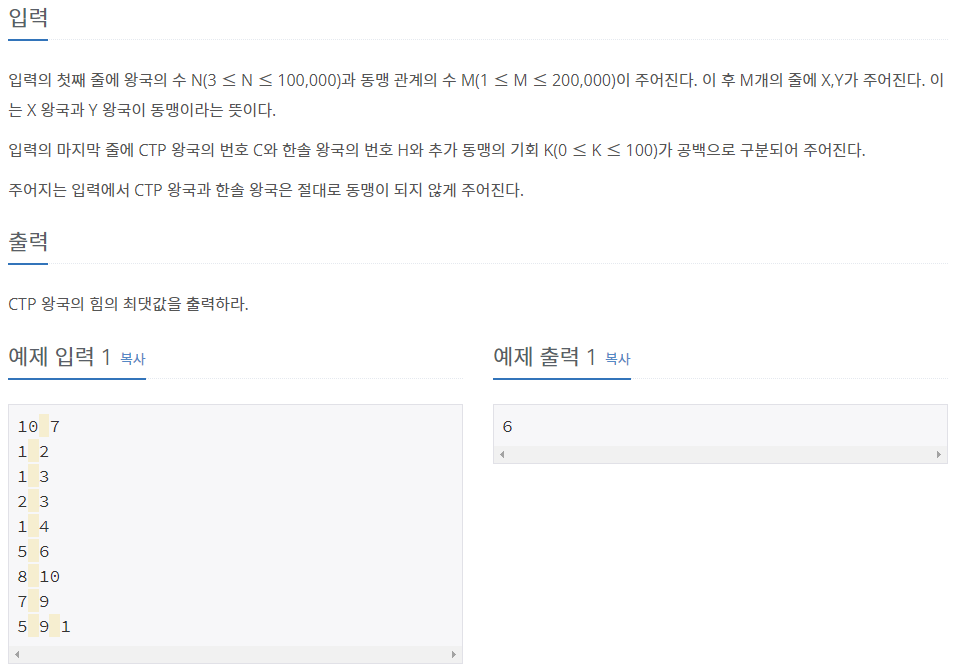

# [[15789] CTP 왕국은 한솔 왕국을 이길 수 있을까?](https://www.acmicpc.net/problem/15789)



___
## 🤔접근
- CTP왕국은 한솔왕국의 동맹관계를 제외한 나머지 왕국 중 동맹 관계가 많은 순으로 K번 더 동맹을 맺을 수 있다.
	- 동맹은 `Disjoint set` 자료구조를 이용하여 맺도록 하자.
___
## 💡풀이
- <B>알고리즘 & 자료구조</B>
	- `Disjoint Set(Union-find)`
- <b>구현</b>
	- 주어진 동맹 관계를 `union-find` 알고리즘을 이용하여 모두 맺어준 다음, K번의 추가 동맹 작업이 필요하다.
		- 각 왕국을 탐색하면서, CTP, 한솔 왕국의 동맹관계가 아닌 나머지 왕국을 탐색하면서, 중복되지 않는 동맹관계를 찾아서 그 수를 내림차순으로 정렬하여 저장하였다.
		- 여기서 K번만큼 하나씩 큰 순으로 꺼내어 CTP 왕국의 힘에 더하였다.
___
## ✍ 피드백
___
## 💻 핵심 코드
```c++
int find(int node) {
	if (node == par[node])
		return node;

	return par[node] = find(par[node]);
}

void merge(int node1, int node2) {
	node1 = find(node1);
	node2 = find(node2);

	if (node1 == node2)
		return;

	if (_rank[node1] > _rank[node2])
		swap(node1, node2);
	par[node1] = node2;
	_size[node2] += _size[node1];

	if (_rank[node1] == _rank[node2])
		++_rank[node2];
}

int main(){
	...

	int par_H = find(H);
	int par_C = find(C);

	vector<int> otherKingdom;
	vector<bool> isVisited(N + 1);
	for (int i = 1; i <= N; i++) {
		int par_i = find(i);

		if (par_i == par_H || par_i == par_C)
			continue;
		if (isVisited[par_i])
			continue;

		otherKingdom.push_back(_size[par_i]);
		isVisited[par_i] = true;
	}
	sort(otherKingdom.begin(), otherKingdom.end(), greater<int>());

	int answer = _size[par_C];
	for (int i = 0; i < K; i++)
		answer += otherKingdom[i];

	cout << answer;

	...
}
```