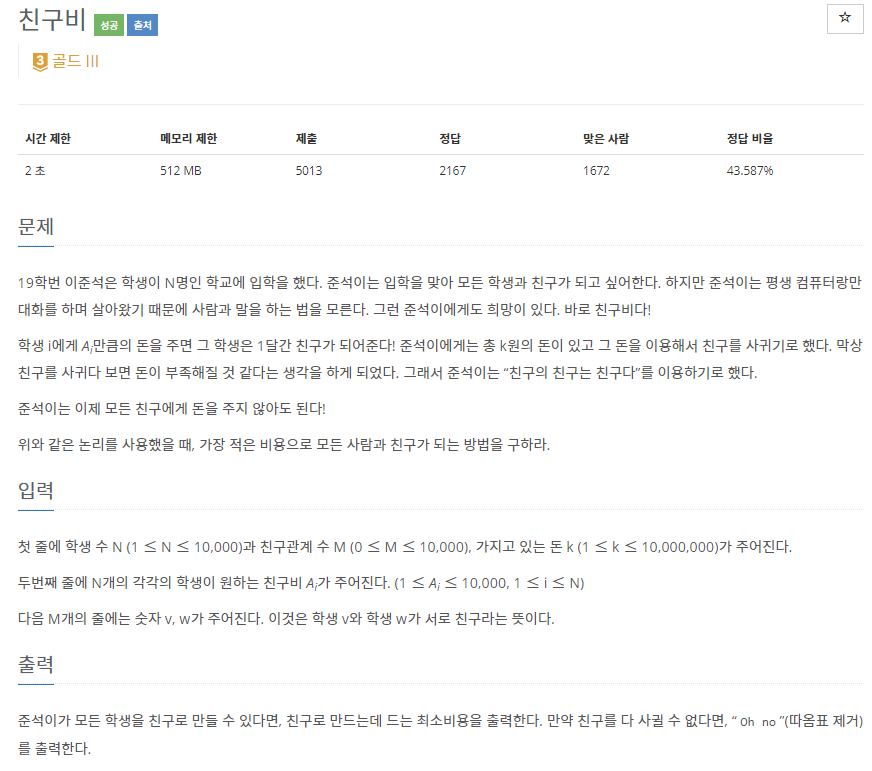
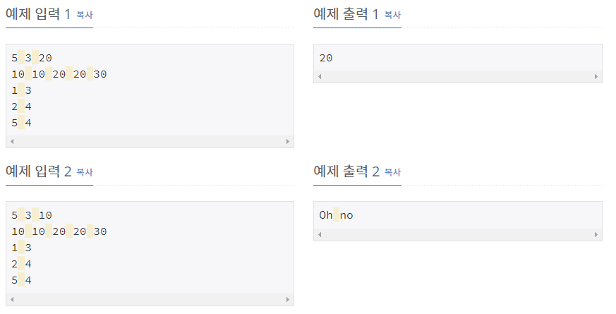

# [[16562] 친구비](https://www.acmicpc.net/problem/16562)



___
## 🤔접근
- "친구의 친구는 친구다"는 친구 관계가 그래프 구조로 이루어져 있다는 뜻이다.
	- 친구비를 최소로 하기 위해서는, 친구 관계를 그래프 중에서도 트리 구조로 보아야 한다.
	- 각 노드를 한 친구 관계로 묶을 때, 친구비가 최소인 노드를 루트로 삼는 방식으로 친구 관계를 넓혀야 한다.
	- 루트가 다른 그룹은 서로 다른 친구 관계이다.
	- 서로소 집합을 나타낼 수 있는 Disjoint Set 자료구조를 이용하자.
- 위의 작업이 모두 끝나고, 학생을 순서대로 탐색하면서 서로 다른 그룹들의 최소 친구비를 더한 값이 바로, 모든 사람과 친구가 될 수 있는 가장 적은 비용이다.
___
## 💡풀이
- <B>알고리즘 & 자료구조</B>
	- `Disjoint Set(Union-find)`
- <b>구현</b>
	- merge 함수에서 같은 지합으로 합칠 때, 친구비가 적은 학생이 루트가 되도록 하였다.
	- 방문 여부(isVisited)를 이용하여, 서로 다른 집합의 루트 값을 모두 더하였다.
___
## ✍ 피드백
___
## 💻 핵심 코드
```c++
int find(int v) {
	if (v == par[v])
		return v;

	return par[v] = find(par[v]);
}

void merge(int u, int v){
	u = find(u);
	v = find(v);

	if (cost[u] < cost[v])
		swap(u, v);

	par[u] = v;
}

int main(){
	...
	for (int i = 1; i <= N; i++) {
		int cur = find(i);
		if (isVisited[cur])
			continue;

		isVisited[cur] = true;
		ans += cost[cur];
	}
	...
}
```