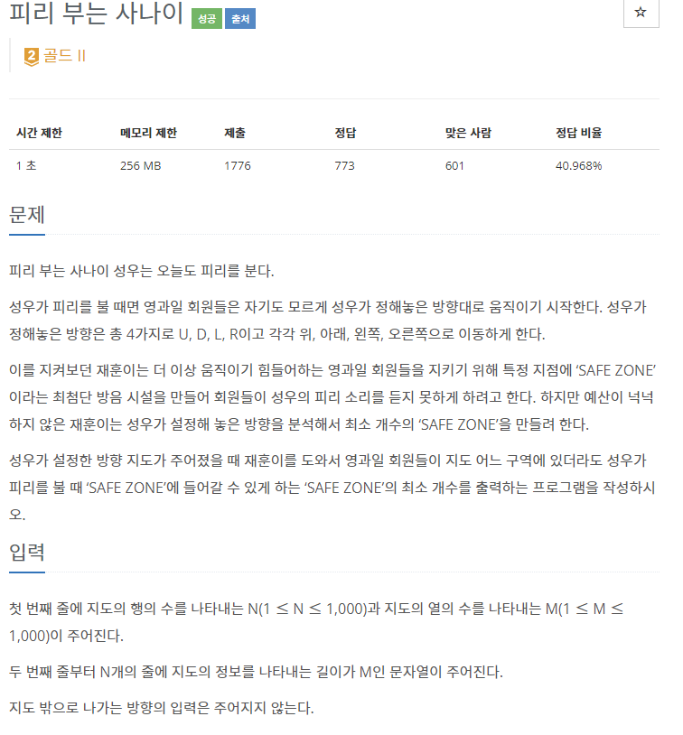
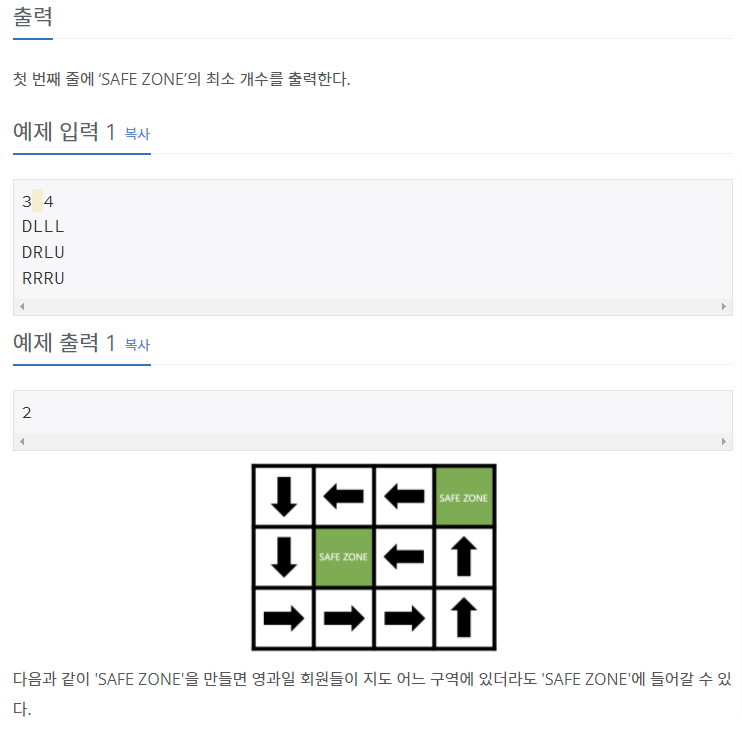

# [[14595] 피리 부는 사나이](https://www.acmicpc.net/problem/16724)



___
## 🤔접근
- 현재 구역과 이동 방향에 있는 구역을 각각 그룹으로 묶은 뒤, 그룹의 개수를 출력하면 된다.
___
## 💡풀이
- <B>알고리즘 & 자료구조</B>
	- `Disjoint Set(Union-find)`
- <b>구현</b>
	- 각 구역을 하나씩 탐색하면서 현재 구역과 이동 방향의 구역을 merge 하였다.
___
## ✍ 피드백
___
## 💻 핵심 코드
```c++
int find(int u) {
	if (u == par[u])
		return u;

	return par[u] = find(par[u]);
}

void merge(int u, int v) {
	u = find(u);
	v = find(v);

	if (u == v)
		return;

	if (_rank[u] < _rank[v])
		swap(u, v);

	par[v] = u;
	ans--;

	if (_rank[u] == _rank[v])
		_rank[u]++;
}

int main() {
	...

	for (int i = 0; i < N * M; i++) {
		int cur = i;
		int next;
		char direction = dir[i / M][i % M];
		if (direction == 'D')
			next = cur + M;
		else if (direction == 'L')
			next = cur - 1;
		else if (direction == 'R')
			next = cur + 1;
		else if (direction == 'U')
			next = cur - M;
		merge(cur, next);
	}

	...
}
```