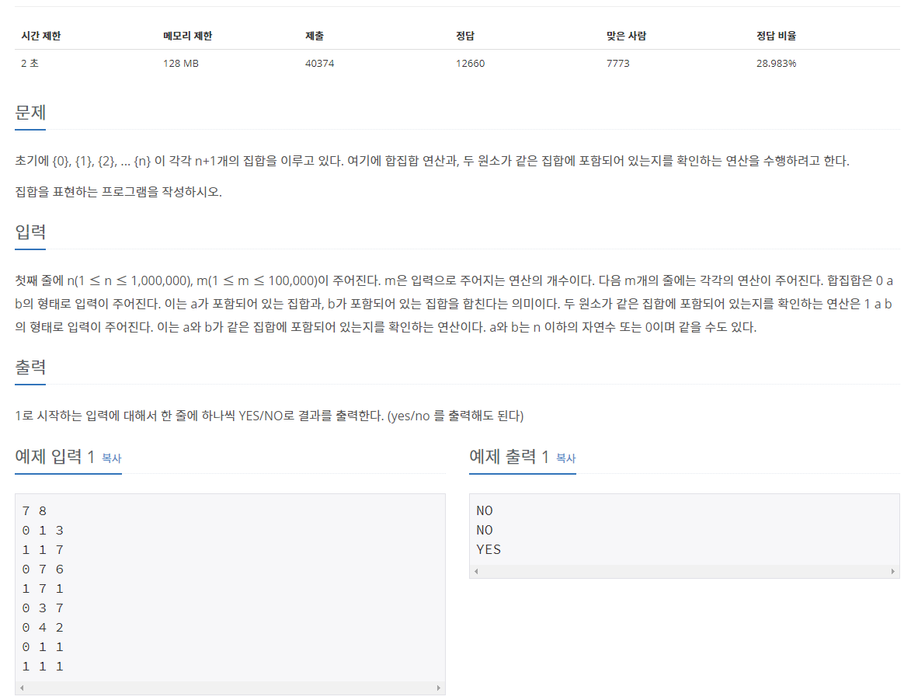

## [[1717] 집합의 표현](https://www.acmicpc.net/problem/1717)


___
## **풀이**
- 분리(서로소) 집합 자료구조를 이용하여, 각 집합들을 union-find하여 결과를 출력하는 문제이다.
```c++
DisjointSet set(n + 1);
while (m--) {
	int cmd, a, b;
	cin >> cmd >> a >> b;
	
	if (cmd == 0) 
		set.merge(a, b);	
	else if (cmd == 1) {
		if (set.find(a) == set.find(b)) 
			cout << "YES\n";
		else 
			cout << "NO\n";
	}
}
```