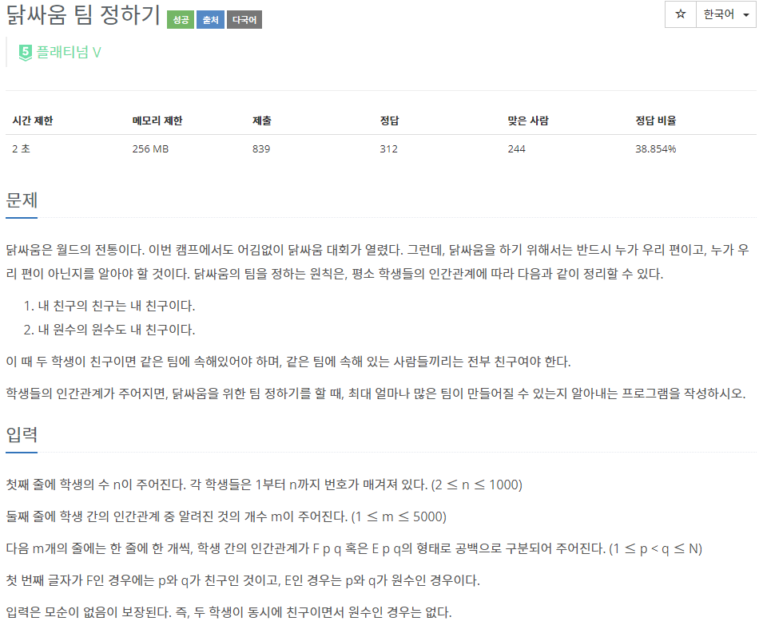
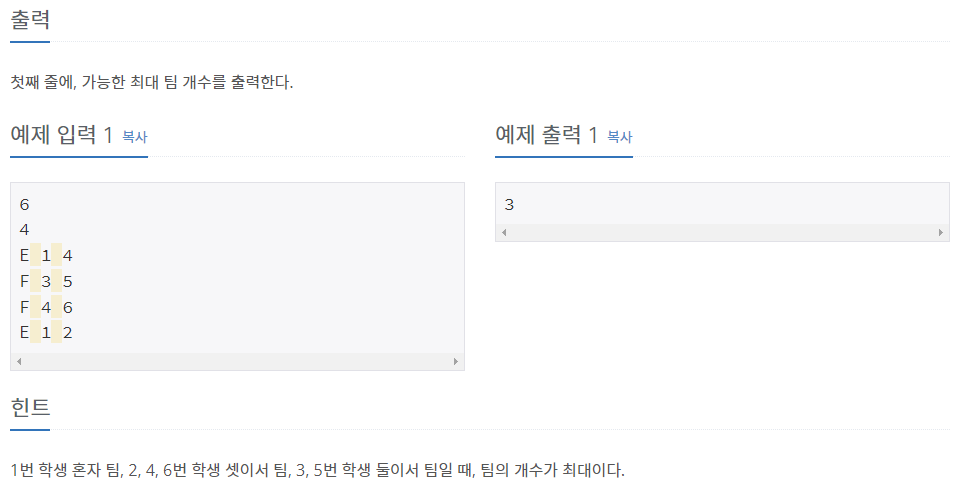

# [[1765] 닭싸움 팀 정하기](https://www.acmicpc.net/problem/1765)



___
## 🤔접근
- 친구 관계는 집합으로 묶고, 원수 관계는 따로 배열로 저장하자.
	- 만약 A와 B가 원수 관계를 맺는다면, A와 B의 원수관계들이 속한 집합들을 merge 해주자.
	- 또한, B와 A의 원수관계들이 속한 집합들을 각각 merge 해주자.
___
## 💡풀이
- <B>알고리즘 & 자료구조</B>
	- `Disjoint Set(Union-find)`
___
## ✍ 피드백
___
## 💻 핵심 코드
```c++
int find(int u) {
	if (u == par[u])
		return u;

	return par[u] = find(par[u]);
}

void merge(int u, int v) {
	u = find(u);
	v = find(v);

	if (u == v)
		return;

	if (_rank[u] < _rank[v])
		swap(u, v);

	par[v] = u;
	ans--;

	if (_rank[u] == _rank[v])
		_rank[u]++;
}

int main() {
	...

	for (int i = 0; i < m; i++) {
		char type;
		int u, v;
		cin >> type >> u >> v;

		if (type == 'F')
			merge(u, v);
		else if (type == 'E') {
			enemy[u].push_back(v);
			enemy[v].push_back(u);

			for (int fr : enemy[u])
				merge(v, fr);
			for (int fr : enemy[v])
				merge(u, fr);
		}
	}

	...
}
```