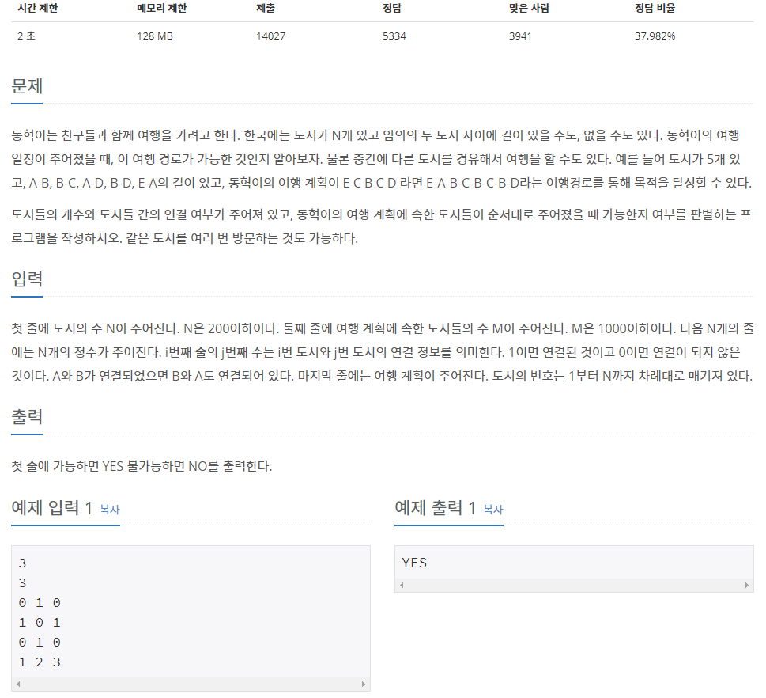

## [[1976] 여행 가자](https://www.acmicpc.net/problem/1976)


___
## **풀이**
- 분리(서로소) 집합 자료구조를 이용하였다.
- 도시가 연결된 경우를 같은 집합으로 여기어 merge하였다.
	```c++
	for (int city = 0; city < n; city++) {
		for (int i = 0; i < n; i++) {
			int next;
			cin >> next;
			if (next == 1)
				set.merge(city, i);
		}
	}
	```
- 입력 마지막 줄에서, 각 도시들을 find연산 했을 때, 결과가 모두 같으면 YES를 출력한다.
	```c++
	stack<int> s;
	while (m--) {
		int city;
		cin >> city;
		s.push(city - 1);
	}

	int cmp = s.top(); s.pop();
	bool flag = true;

	while (!s.empty()) {
		if (set.find(cmp) != set.find(s.top())) {
			flag = false;
			break;
		}
		s.pop();
	}

	if (flag)
		cout << "YES";
	else
		cout << "NO";
	```