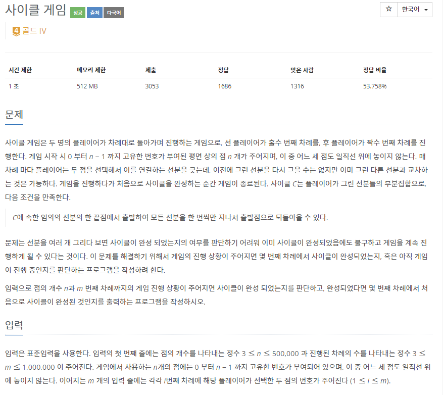
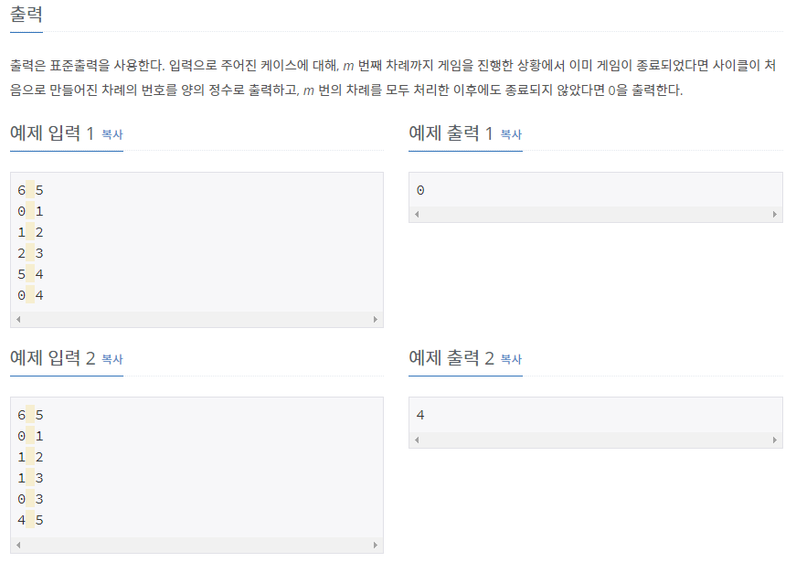

# [[20040] 사이클 게임](https://www.acmicpc.net/problem/20040)



___
## 🤔접근
- 무방향 그래프에서 사이클을 찾는 문제이다.
	- Disjoint-set을 이용하자.
___
## 💡풀이
- <B>알고리즘 & 자료구조</B>
	- `Disjoint Set(Union-find)`
- <b>구현</b>
	- Disjoint-set을 이용하여 사이클이 존재하면 ans에 순번을 저장하였다.
	- ans에 이미 순번이 저장된 경우에는 merge 함수 호출을 생략함으로써 최적화하였다.
___
## ✍ 피드백
___
## 💻 핵심 코드
```c++
int find(int v) {
	if (v == par[v])
		return v;

	return par[v] = find(par[v]);
}

void merge(int u, int v){
	u = find(u);
	v = find(v);

	if (u == v) {
		isCycle[u] = true;
		return;
	}

	if (isCycle[u] || isCycle[v]) {
		isCycle[u] = true;
		isCycle[v] = true;
	}

	if (_rank[u] < _rank[v])
		swap(u, v);

	par[v] = u;
	if (_rank[u] == _rank[v])
		_rank[u]++;
}

int main(){
	...
	for (int i = 1; i <= m; i++) {
		int u, v;
		cin >> u >> v;

		if (ans != 0)
			continue;

		merge(u, v);

		if (isCycle[find(u)]) 
			ans = i;
	}
	...
}
```