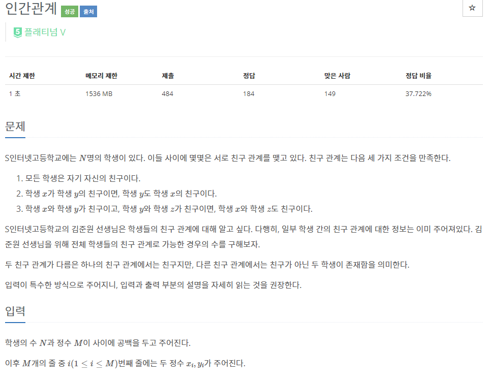
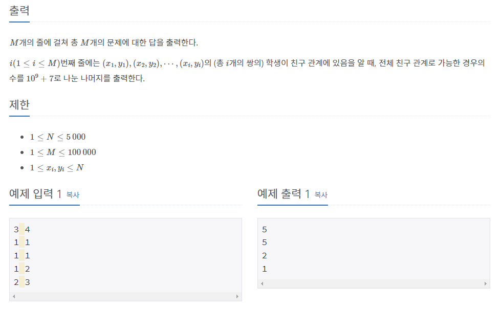

# [[20531] 인간관계](https://www.acmicpc.net/problem/20531)



___
## 🤔접근
- 친구 관계는 그룹으로 묶고, 이 친구 관계 그룹들과 나머지 학생들의 조합 경우의 수를 구하는 문제이다.
___
## 💡풀이
- <B>알고리즘 & 자료구조</B>
	- `Disjoint Set(Union-find)`
	- `Dynamic Programming`
- <b>구현</b>
	- 먼저, 모든 조합 경우의 수를 `dp` 배열에 저장한 다음, 친구 관계를 각각 merge하면서 그 때 마다 조합 경우의 수를 출력하자.
	- <b>기저 조건</b>
		```c++
		for (int i = 1; i <= n; i++)
			dp[i][1] = dp[i][i] = 1;
		```
	- <b>점화식</b>
		```c++
		for (int i = 2; i <= n; i++) 
			for (int j = 2; j < i; j++) 
				dp[i][j] = (dp[i - 1][j - 1] + dp[i - 1][j] * j) % MOD;
		```
___
## ✍ 피드백
___
## 💻 핵심 코드
```c++
int find(int u) {
	if (u == par[u])
		return u;

	return par[u] = find(par[u]);
}

void merge(int u, int v) {
	u = find(u);
	v = find(v);

	if (u == v)
		return;

	if (_rank[u] < _rank[v])
		swap(u, v);
	
	N--;
	par[v] = u;
	if (_rank[u] == _rank[v])
		_rank[u]++;
}

int main() {
	...

	for (int i = 0; i < m; i++) {
		int u, v;
		cin >> u >> v;
		merge(u, v);

		long long ans = 0;
		for (int i = 1; i <= N; i++)
			ans += dp[N][i];
	
		cout << ans % MOD << '\n';
	}

	...
}
```