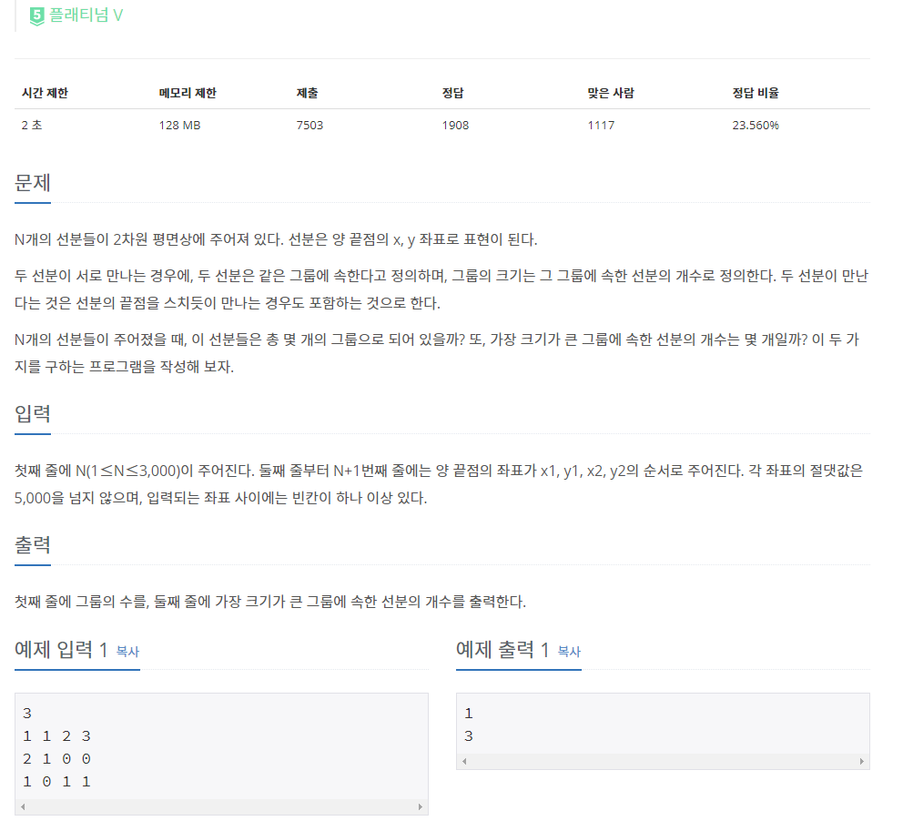

## [[2162] 선분 그룹](https://www.acmicpc.net/problem/2162)


___
## **풀이**
- 분리(서로소) 집합 자료구조와 [CCW 알고리즘을 이용한 선분교차판별](https://github.com/seonpilKim/Algorithm/tree/master/Geometric/CCW)을 이용하였다.
- 선분이 교차하는 경우, 해당 그룹들을 union연산한다.
- `집합의 수`는 각 노드의 부모가 자신인 경우에만 증가시킴으로써 알아낼 수 있다.
	- 이 과정에서 각 `집합에 속한 선분의 개수`도 구할 수 있다.
		- 각 노드의 부모가 자신인 경우, 해당 노드의 size를 증가시킨다.
		- 각 노드의 부모가 자신이 아닌 경우, 해당 노드를 find연산하여 부모를 찾은 다음, 부모 노드의 size를 증가시킨다.
```c++
for (int i = 0; i < this->par.size(); i++) {
	if (par[i] == i) {
		groups++;
		size[i]++;
		if (size[i] > max)
			max = size[i];
	}
	else {
		int node = find(i);
		size[node]++;
		if (size[node] > max)
			max = size[node];
	}
}
```
- 각 선분끼리 모두 선분교차여부를 확인해야 하므로 시간복잡도는 `O(n²)`이다.