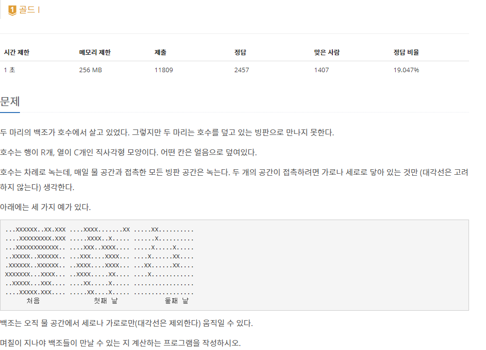

## [[3197] 백조의 호수](https://www.acmicpc.net/problem/3197)



___
## **풀이**
- 분리(서로소) 집합 자료구조와 BFS(넓이 우선 탐색) 알고리즘을 이용하였다.
- **💡Idea**
	- 매일 물과 접촉한 얼음들을 녹이며, 근접한 물끼리 집합으로 union하고, 두 백조의 집합이 동일한 집합이 되는 순간이 백조가 만나는 순간이다. 
		- 처음에는 모든 물의 위치를 큐1에 담는다.
		```c++
		void input(int row, int col) {
			int idx = 0;
			for (int i = 0; i < row; i++) {
				for (int j = 0; j < col; j++) {
					char input;
					cin >> input;
					arr[i][j] = make_pair(input, false);
					if (input == 'L' || input == '.') {
						if (input == 'L')
							duck[idx++] = make_pair(i, j);
						arr[i][j] = make_pair(input, true);
						q.push(make_pair(i, j));
					}
					par[i][j] = make_pair(i, j);
				}
			}
		}
		```
		- 큐1의 원소들을 하나하나 BFS하면서, 물에 접촉한 얼음의 위치를 찾아 큐2에 담고, 물에 접촉한 물의 위치를 찾아 같은 집합으로 union한다.
		```c++
		while (!q.empty()) {
			pair<int, int> cur = q.front(); q.pop();
			int x = cur.first;
			int y = cur.second;

			for (int i = 0; i < 4; i++) {
				int nx = x + dx[i];
				int ny = y + dy[i];

				if (check(nx, ny) == false)
					continue;

				pair<int, int> next = make_pair(nx, ny);

				if (arr[nx][ny].first == 'X' && arr[nx][ny].second == false) {
					arr[nx][ny].second = true;
					next_q.push(next);
				}
				else if (arr[nx][ny].first != 'X') 
					merge(cur, next);
			}
		}
		```
		- 큐1의 원소들을 모두 처리한 다음, 두 백조의 집합을 서로 비교하여, 같은 집합이라면 time을 출력하고 종료한다.
		```c++
		if (find(duck1.first, duck1.second) == find(duck2.first, duck2.second)) {
			cout << time;
			return;
		}
		```
		- 큐2에 담긴 얼음들을 모두 녹여서 큐1에 담고, time을 1 증가시키고, 위 과정을 반복한다.
		```c++
		while (!next_q.empty()) {
			pair<int, int> p = next_q.front(); next_q.pop();
			arr[p.first][p.second].first = '.';
			q.push(p);
		}

		time++;
		```
