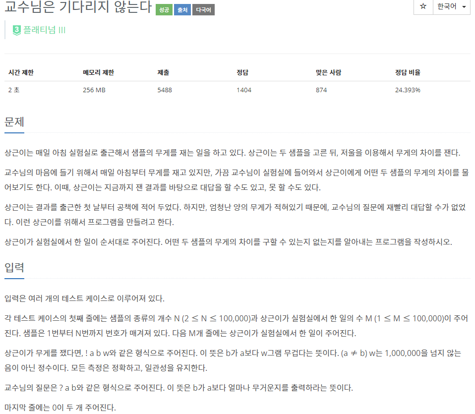
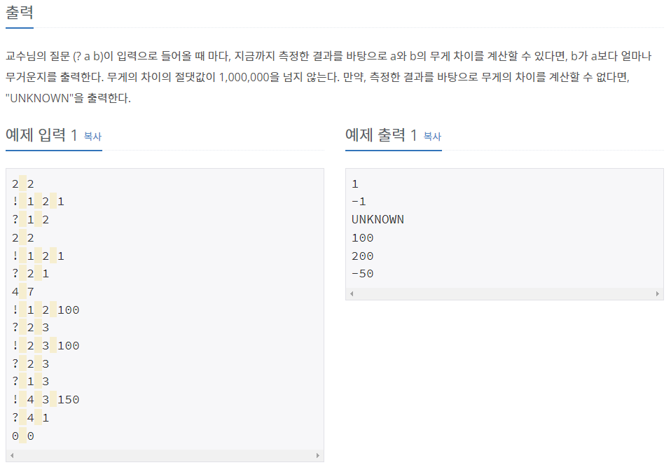
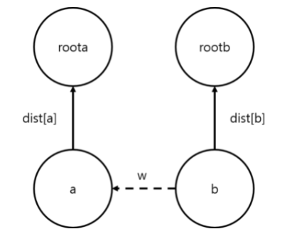
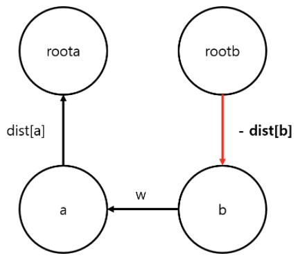

# [[3830] 교수님은 기다리지 않는다](https://www.acmicpc.net/problem/3830)



___
## 🤔접근
- 예를 들어, a가 b보다 100만큼 무겁다는 결과와 b가 c보다 50만큼 무겁다는 결과가 있을 때, a가 c보다 150만큼 무겁다는 결과를 도출해낼 수 있어야 한다.
	- 각 비교한 샘플들을 같은 집합으로 묶고, 한 샘플을 그 집합의 root로 삼자.
	- 각 샘플마다 root와의 무게 차이를 저장하자.
	- 현재 root가 다른 집합의 root의 밑으로 들어갈 때, 현재 root 밑의 모든 샘플들도 root를 다른 집합의 root로 바꾸고, 다른 집합의 root와의 무게 차이를 각각 저장해야 한다.
___
## 💡풀이
- <B>알고리즘 & 자료구조</B>
	- `Disjoint Set(Union-find)`
- <b>구현</b>
	- `dist[샘플]`에 해당 샘플의 root와의 무게의 차를 저장하였다.
	- 예를 들어, a가 b보다 w만큼 무겁다는 결과를 얻어 한 집합으로 묶는다고 해보자.<br>
		<br>
		- 여기서 b의 root는 roota로 바뀌게 되므로, rootb의 root도 roota로 수정해주어야 한다.
		- `dist[rootb]`를 rootb와 roota의 무게 차를 저장해야 하는데, 위의 그림을 아래와 같이 바꾸어 보면 쉽게 공식을 도출해낼 수 있다.<br>
		<br>
		- 결국, `dist[roob]`는 `dist[a] + w - dist[b]`가 된다.
		- 이를 `merge` 함수에 적용하면 아래와 같다.
			```c++
			void merge(int u, int v, int w){
				int par_u = find(u);
				int par_v = find(v);

				if (par_u == par_v)
					return;

				par[par_v] = par_u;
				dist[par_v] = dist[u] - dist[v] + w;
			}
			```
		- 또한, b와 rootb 사이에 여러 중간 샘플들이 존재할 수 있으므로, `find` 함수를 아래와 같이 변형해주어야 한다.
			```c++
			int find(int u) {
				if (u == par[u])
					return u;

				int root = find(par[u]);
				dist[u] += dist[par[u]];
				return par[u] = root;
			}
			```
			- root까지 먼저 재귀호출하여 들어간 다음, 빠져나오면서 각 `dist[중간 샘플]`에 rootb와 roota의 무게 차이가 저장된 `dist[rootb]` 값을 더해주는 과정이다.
			- 이렇게 하면, b와 rootb 사이의 모든 샘플들에도 비교 결과가 저장된다.
___
## ✍ 피드백
___
## 💻 핵심 코드
```c++
int main() {
	...

	while (true) {
		int N, M;
		cin >> N >> M;
		if (N == 0 && M == 0)
			break;

		for (int i = 1; i <= N; i++) {
			par[i] = i;
			dist[i] = 0;
		}

		for (int m = 0; m < M; m++) {
			char cmd;
			cin >> cmd;

			if (cmd == '!') {
				int u, v, w;
				cin >> u >> v >> w;
				merge(v, u, w);
			}
			else if (cmd == '?') {
				int u, v;
				cin >> u >> v;
				if (find(u) != find(v))
					cout << "UNKNOWN\n";
				else
					cout << dist[u] - dist[v] << '\n';
			}
		}
	}

	...
}
```