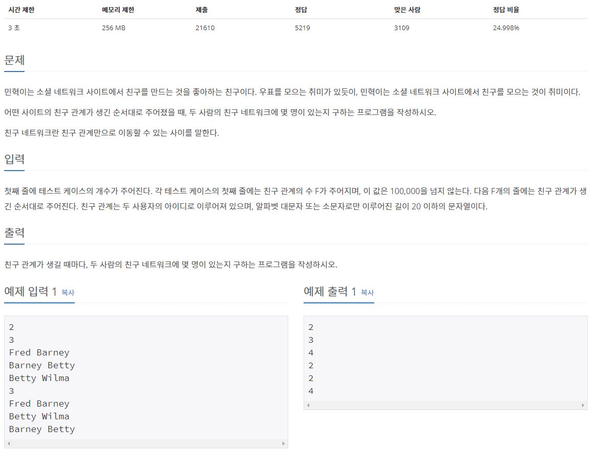

## [[4195] 친구 네트워크](https://www.acmicpc.net/problem/4195)


___
## **풀이**
- 분리(서로소) 집합 자료구조를 이용하였다.
- 사람의 이름을 노드 번호로 매핑하기위해 map 자료구조를 추가로 사용하였다.
	```c++
	class DisjointSet {
	private:
		vector<int> par, rank, size;
		map<string, int> people;
		int idx;
		...
	}
	```
	- 친구 네트워크에 존재하는 친구의 수를 나타내기 위해 `vector<int> size`를 추가하였다.
	- 새로운 사람이 추가될 때 마다, idx를 증가시키며 `map<string, int> people`에 <name, idx> 형태로 저장한다.
- 또한, 기존의 merge 함수를 다음과 같이 수정하였다.
	```c++
	void merge(string person1, string person2) {
		// 먼저 해당 이름들이 map에 존재하는지 체크한다.
		// 존재한다면, 해당 index를 node에 저장한다.
		// 존재하지 않는다면, map에 정보를 입력하고 해당 index를 node에 저장한다.
		int node1, node2;
		if (people.find(person1) == people.end()) {
			people.emplace(person1, idx);
			node1 = idx++;
		}
		else 
			node1 = people.find(person1)->second;
		
		if (people.find(person2) == people.end()) {
			people.emplace(person2, idx);
			node2 = idx++;
		}
		else
			node2 = people.find(person2)->second;

		node1 = find(node1);
		node2 = find(node2);

		if (node1 != node2) {

			if (rank[node1] > rank[node2])
				swap(node1, node2);
			par[node1] = node2;
			size[node2] += size[node1];

			if (rank[node1] == rank[node2])
				++rank[node2];
		}

		// merge가 끝나면, 해당 친구 네트워크에 존재하는 친구의 수를 출력한다.
		cout << size[node2] << '\n';
	}
	```