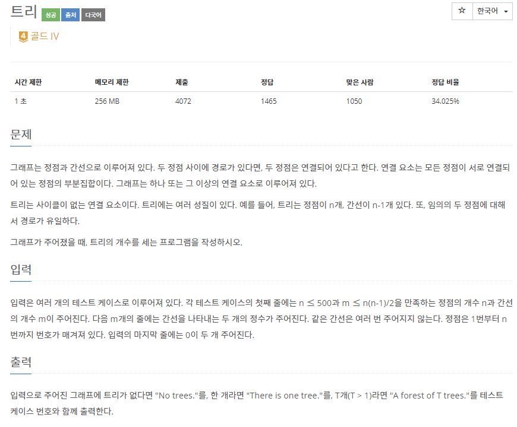
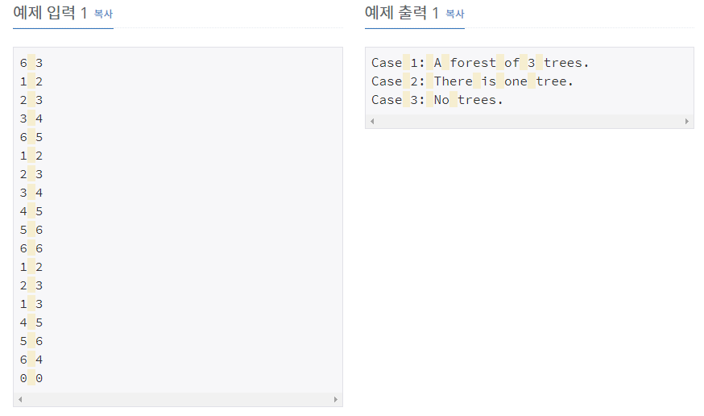

# [[4803] 트리](https://www.acmicpc.net/problem/4803)



___
## 🤔접근
- 각 정점의 연결 정보가 주어졌을 때, 서로 다른 트리의 개수를 구하는 문제다.
	- 사이클이 포함되면 트리가 아니므로, 사이클 존재 여부도 체크해야 한다.
	- 서로 다른 트리는 결국 서로 다른 집합이라는 의미이다.
	- 또한, 트리는 무방향 그래프에 속한다.
	- 무방향 그래프에서 사이클 존재 여부를 쉽게 찾을 수 있고, 서로 다른 집합인지 체크할 수 있는 Disjoint set을 이용하자.
___
## 💡풀이
- <B>알고리즘 & 자료구조</B>
	- `Disjoint Set(Union-find)`
- <b>구현</b>
	- 두 정점의 부모가 같거나, 두 정점 중 하나가 사이클에 속한다면, 해당 정점들은 사이클을 이룬다는 것이다.
		- 이를 merge 함수에서 체크하였다.
	- 각 정점들을 순서대로 방문하면서, 방문 여부를 통해 서로 다른 그룹인 것을 체크하고, 사이클 여부를 통해 해당 그룹을 트리로 간주할 지를 판단하였다.
___
## ✍ 피드백
___
## 💻 핵심 코드
```c++
int find(int v) {
	if (v == par[v])
		return v;

	return par[v] = find(par[v]);
}

void merge(int u, int v){
	u = find(u);
	v = find(v);

	if (u == v) {
		isCycle[u] = true;
		return;
	}

	if (isCycle[u] || isCycle[v]) {
		isCycle[u] = true;
		isCycle[v] = true;
	}

	if (_rank[u] < _rank[v])
		swap(u, v);

	par[v] = u;
	if (_rank[u] == _rank[v])
		_rank[u]++;
}

int main(){
	...
	for (int i = 1; i <= n; i++) {
		int target = find(i);
		if (isVisited[target] || isCycle[target])
			continue;

		cnt++;
		isVisited[target] = true;
	}
	...
}
```