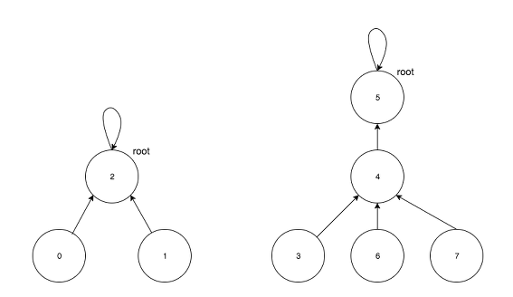
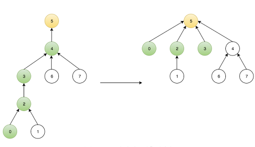

# Disjoint Set(서로소 집합)
<br>
- 두 개의 트리로 이루어진 Disjoint Set

## 개념
- 서로 중복되지 않는 집합들로 나누어진 원소들에 대한 정보를 저장하고 조작하는 자료구조이다.
- 트리 구조로 구현한다.
	- 각 노드는 부모 노드에 대한 포인터 정보를 가진다.
		- 처음에는 각자 노드의 부모 노드를 자신을 가리키도록 초기화한다.
	- 위의 정보를 바탕으로 최종 부모인 root 노드가 무엇인지 알아낼 수 있다.
	- root 노드가 서로 다른 집합인 경우만 두 집합(트리)을 합친다.
- 최악의 경우는 완전히 비대칭적인 트리, 즉 연결 리스트 형태가 되는 경우이다.
	- 모든 연산이 O(N)이 되어버려, 배열로 구현했을 때 보다 효율이 나빠지게 된다.
	- 이 문제는 두 트리를 합칠 때, 항상 `높이가 더 낮은 트리를 높이가 높은 트리의 밑으로 넣음`으로써 해결가능하다.
		- 이러한 최적화를 `union-by-rank`라고 하며, 여기서 `rank`는 해당 트리의 높이를 저장한다.
		- 이 때, 시간 복잡도는 `O(log₂N)`이 된다.
	- 또한, `경로 압축`을 통해 추가로 최적화가 가능하다.
		- find(u)로 root를 찾았을 때, u의 부모를 root로 바꿔버리는 것을 경로 압축이라 한다.
- find & union 시간 복잡도 : `O(a(N))`
	- Disjoint Set의 연산 수행시간을 분석하는 것은 매우 어렵다.
		- Find 연산을 호출 할 때마다, 트리의 높이 변화에 의해 수행시간이 달라지기 때문이다.
	- `a(N)`은 에커만 함수를 이용하여 정의된 함수이다.
	- N이 2^65536일 때, 에커만 함수 값이 5가 된다.
	- 따라서 현실적인 모든 입력에 대해 상수시간, `O(1)`이라고 보아도 무방하다.

## 주요 연산
### Union
```c++
void merge(int node1, int node2) {
	node1 = find(node1);
	node2 = find(node2);

	if (node1 == node2)
		return;

	// 두 트리를 합병할 때, 항상 높이가 더 낮은 트리를 높이가 더 높은 트리 밑으로 집어넣는다.
	if (rank[node1] > rank[node2])
		swap(node1, node2);
	par[node1] = node2;

	// 두 트리의 높이가 동일한 경우, 합병 후 결과 트리의 높이를 1 증가시킨다.
	if (rank[node1] == rank[node2])
		++rank[node2];
}
```
### Find
```c++
int find(int node) {
	if (node == par[node])
		return node;

	// 경로 압축
	return par[node] = find(par[node]);
}
```
> ex) find(0) 결과<br>

