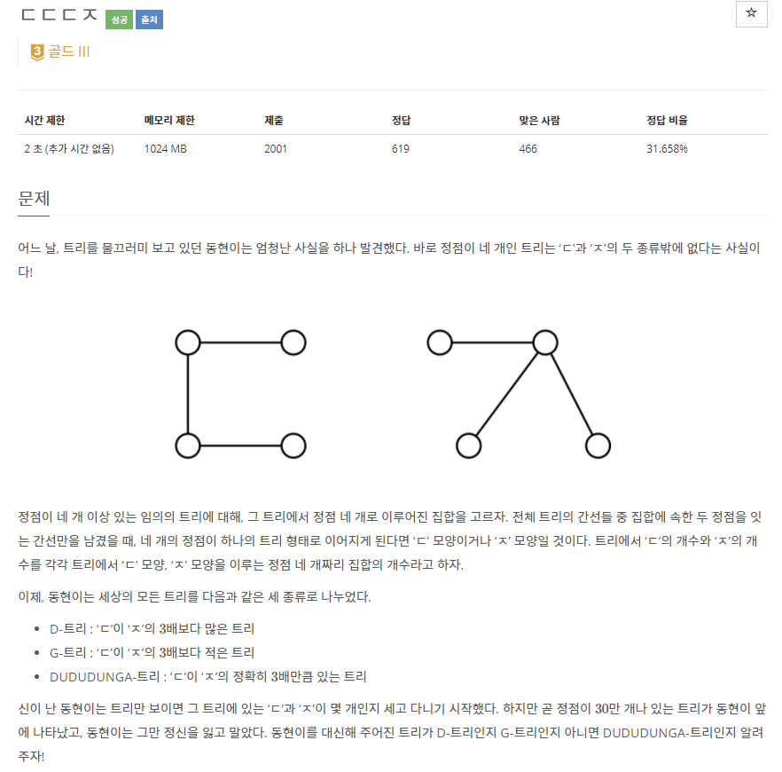
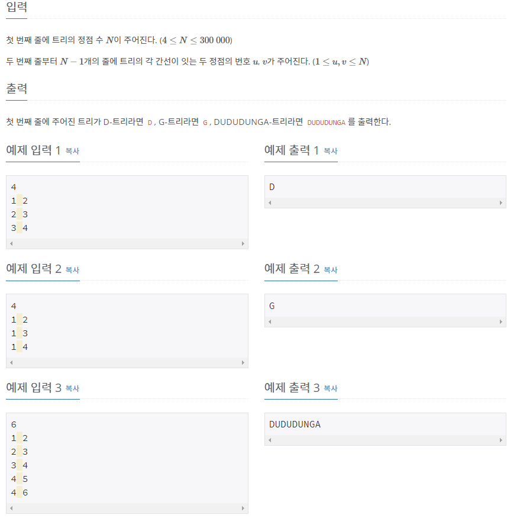

# [[19535] ㄷㄷㄷㅈ](https://www.acmicpc.net/problem/19535)



___
## 🤔접근
1. <B>D-트리와 G-트리가 생길 수 있는 경우의 수를 구하자.</B>
	- 먼저 D-트리의 구조를 보면, 4개의 정점이 이어져 있는 것을 확인할 수 있다.
		- 여기서 중간에 위치한 두 정점을 기준으로 보자.
		- 각 정점에 연결된 정점이 많을수록 D-트리가 여러 개 존재하는 것을 알 수 있다.
		- 즉, 두 정점을 연결한 개수를 뺀, 나머지 각 정점에 연결된 정점의 개수를 서로 곱해주면, 두 정점을 이용해 만들 수 있는 D-트리의 개수가 나온다.
	- 다음으로 G-트리의 구조를 보면, 하나의 정점에 3개의 정점이 이어져 있는 것을 확인할 수 있다.
		- 한 정점에 3개 이상의 정점이 연결되어 있어도 항상 3개만 선택해야 G-트리를 이룬다.
		- 즉, 한 정점에 연결된 정점의 개수를 n이라 할 때, nC3이 바로 해당 정점으로 만들 수 있는 G-트리의 개수이다.
___
## 💡풀이
- <B>알고리즘</B>
	- 수학, 조합론
- <b>자료구조</b>
	- Tree
- <b>구현</b>
	- 각 정점을 탐색하면서 다음의 작업을 진행하였다.
		- 이 정점에 연결된 정점마다 다음의 작업을 진행하였다.
			- <b>D-트리의 개수</b> += `(정점A에 연결된 정점 개수 - 1) * (정점B에 연결된 정점 개수 - 1)`
		- <b>G-트리의 개수</b> += `(정점A에 연결된 정점 개수) * (정점A에 연결된 정점 개수 - 1) * (정점A에 연결된 정점 개수 - 2) / 6`
___
## ✍ 피드백
___
## 💻 핵심 코드
```c++
int main() {
	...

	for (int i = 1; i <= N; i++) {
		long long int _size = adj[i].size();

		for (int j = 0; j < _size; j++)
			D += (_size - 1) * (adj[adj[i][j]].size() - 1);

		G += _size * (_size - 1) * (_size - 2) / 6;
	}
	D /= 2;

	if (D > 3 * G)
		cout << 'D';
	else if (D < 3 * G)
		cout << 'G';
	else
		cout << "DUDUDUNGA";

	...
}
```