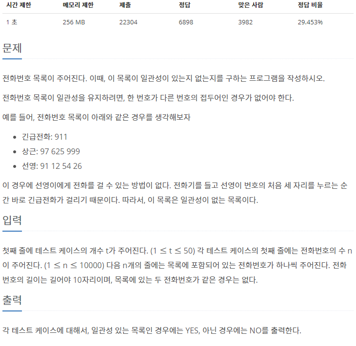
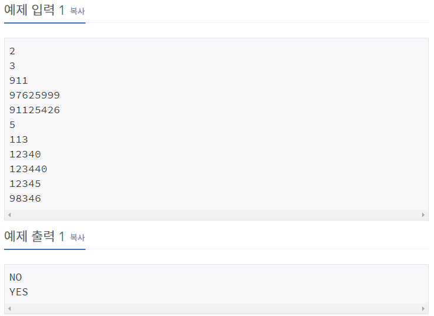
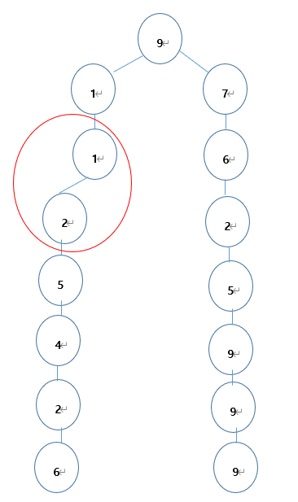

## [[5052] 전화번호 목록](https://www.acmicpc.net/problem/5052)



___
## **풀이**
- 모든 전화번호를 서로 비교하는 것은 매우 비효율적이다 - O(N!)
- 전화번호를 앞에서부터 트리의 형태로 저장한다면, 상당히 많은 중복비교를 피할 수 있다.
- 
	- 위의 그림과 같이 예시의 전화번호를 추가한다.
	- 전화번호를 추가하는 도중에 빨간 원으로 표시된 부분이 발견되면 `NO`를 출력하고, 조건은 다음과 같다.
		1. 추가한 전화번호가 목록에 존재하는 전화번호의 앞 부분인 경우
			> ex)<br>
			> 2<br>
			> 9123<br>
			> 91<br>
		2. 추가한 전화번호의 앞 부분이 목록에 존재하는 경우
			> ex)<br>
			> 2<br>
			> 91<br>
			> 9123<br>
		```c++
		bool add(string digits) {
			Node* cur = this->root;
			int idx = 0;

			for (char digit : digits) {
				bool flag = true;

				// 1, 2번 조건 테스트
				for (Node* chi : cur->chi) {
					if (chi->digit == digit) {
						if (idx == digits.size() - 1 || chi->chi.size() == 0)
							return false;

						cur = chi;
						flag = false;
						break;
					}
				}

				// 앞 부분이 동일한 전화번호가 없는 경우
				if (flag) {
					cur->chi.push_back(new Node(digit));
					cur = cur->chi.back();
				}

				idx++;
			}

			return true;
		}
		```

## 다른 풀이
- 전화번호 문자열을 sort한 다음, 첫 번째 전화번호부터 두 개씩 비교하는 방식으로도 해결할 수 있다.
- 더 짧은 전화번호가 비교하는 전화번호의 접두사에 해당하면 `NO`를 출력하는 방식이다.
- 트리를 구현한 것 보다 약 3배 가량 빠르게 해결할 수 있다.
