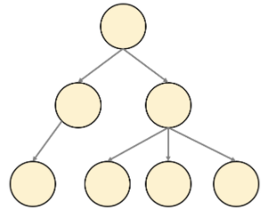

# General Tree, 일반 트리

## 개념
- 그래프의 일종으로, 여러 노드가 한 노드를 가리킬 수 없는 비선형 구조이다. 
- 간단하게는 사이클(cycle)이 없고, 서로 다른 두 노드를 잇는 길이 하나뿐인 그래프를 트리라고 부른다.

## 종류
 - `Binary Tree`
 - `Binary Search Tree`
 - `AVL Tree`
 - `Red-Black Tree`
 - etc.

## 주요 연산
### 삽입 연산
- `insert(par_data, data)` : par_data를 갖는 부모노드에 data를 가진 자식노드를 삽입.
- data를 삽입하는 연산 자체는 `O(1)`이지만, data를 삽입할 위치를 찾는 연산이 `O(n)`이다.
- 시간 복잡도 : `O(n)`
```c++
void insert(const T& par_data, const T& data) {
	Node<T>* newNode = new Node<T>(data);
	if (this->_size == 0)
		this->_root = newNode;
	else {
		Node<T>* parNode = search(par_data);
		if (parNode == nullptr) return;
		parNode->children.push_back(newNode);
		newNode->par = parNode;
	}
	this->_size++;
}
```
### 삭제 연산
- 해당 data를 가진 노드를 찾고, 해당 노드의 부모와 자식노드들을 연결시켜준다.
- 시간 복잡도 : `O(n)`
```c++
void remove(const T& data) {
	Node<T>* delNode = search(data);
	if (delNode == nullptr || delNode == this->_root) return;
	for (Node<T>* child : delNode->children) {
		child->par = delNode->par;
		delNode->par->children.push_back(child);
	}
	int idx = 0;
	for (Node<T>* child : delNode->par->children) {
		if (child == delNode) {
			delNode->par->children.erase(delNode->par->children.begin() + idx);
			break;
		}
		idx++;
	}
	delete delNode;
	this->_size--;
}
```
### 탐색 연산
- data를 가진 노드를 찾기 위해 트리 전체를 탐색한다.
- 시간 복잡도 : `O(n)`
```c++
Node<T>* search(const T& data) const {
	if (this->_root->data == data) 
		return this->_root;

	Node<T>* curNode;
	queue<Node<T>*> q;
	q.push(this->_root);

	while (!q.empty()) {
		curNode = q.front(); q.pop();
		for (Node<T>* child : curNode->children) {
			if (child->data == data) 
				return child;
			q.push(child);
		}
	}

	return nullptr;
}
```

### 순회
#### 전위 순회(preorder traversal)
- 먼저 처리(process)를 한 다음, 자식노드를 탐색하는 순서로 순회한다.
```c++
void _preorder(Node<T>* curNode) const {
	process(curNode);
	for (Node<T>* child : curNode->children) {
		_preorder(child);
	}
}
```
#### 후위 순회(postorder traversal)
- 자식노드를 먼저 탐색하고 처리(process)를 하는 순서로 순회한다.
```c++
void _postorder(Node<T>* curNode) const {
	for (Node<T>* child : curNode->children) {
		_postorder(child);
	}
	process(curNode);
}
```

## 사용 용도
- 파일 시스템(File System)
- 계층적 데이터 관리 시스템
- etc.