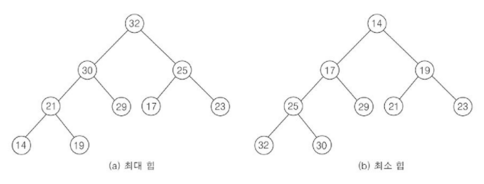
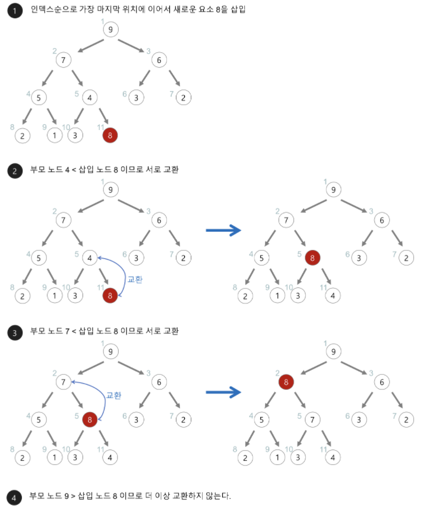
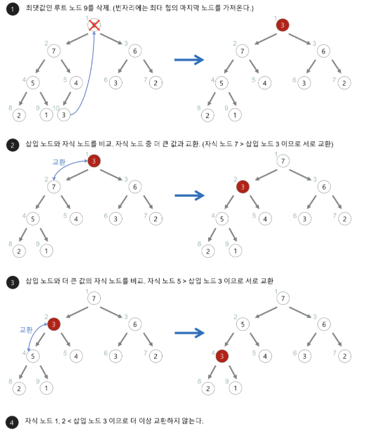

# Heap, 힙

## 개념
- [완전 이진 트리](https://github.com/seonpilKim/Data-Structure/tree/master/Tree/Binary%20Tree)에 있는 노드 중에서` key 값이 가장 큰 노드` 또는 `key 값이 가장 작은 노드`를 찾기 위해서 만든 자료구조이며, `우선순위 큐`를 구현하는 데 사용되기도 한다.
- 힙은 일종의 `반정렬 상태(느슨한 정렬 상태)`를 유지한다.
    - 큰(작은) 값이 상위 레벨에 있고 작은(큰) 값이 하위 레벨에 있다는 정도
    - [이진 탐색 트리](https://github.com/seonpilKim/Data-Structure/tree/master/Tree/Binary%20Search%20Tree)와 달리, 힙은 `중복 값을 허용`한다.
- 완전 이진 트리는 `배열로 구현`하는 것이 쉬우며, 0 번째 index 는 사용하지 않는다.
___
## 종류
1. `최대 힙(max heap)`
    - key 값이 가장 큰 노드를 찾기 위한 완전 이진 트리
    - 부모 노드의 key 값 >= 자식 노드의 key 값
    - root 노드 : key 값이 가장 큰 노드
2. `최소 힙(min heap)`
    - key 값이 가장 작은 노드를 찾기 위한 완전 이진 트리
    - 부모 노드의 key 값 <= 자식 노드의 key 값
    - root 노드 : key 값이 가장 작은 노드


___

## 탐색 연산
- 일반적으로 힙을 사용하는 이유는 max 또는 min 값을 빠르게 찾기 위함이다.
- root 노드에 max 또는 min 값이 있으므로 한 번에 탐색할 수 있다.
- 시간 복잡도 : `O(1)`
```c++
T peek() const {
		return this->BST[this->root_idx];
}
```
___
## 삽입 연산

- BST의 가장 `마지막 index 에 삽입`하고, `UpHeap 연산`을 통해 부모노드와 swap 시킨다.
- 시간 복잡도 : `O(log N)`
```c++
void UpHeap(int idx) {
		while (idx != this->root_idx && this->BST[idx] * this->type > this->BST[par(idx)] * this->type) {
			swap(idx, par(idx));
			idx = par(idx);
		}
}

void insert(const T& data) {
		if (this->BST.size() == 0)
			this->BST.push_back(data);
		this->BST.push_back(data);
		UpHeap(this->BST.size() - 1);
}
```
___
## 삭제 연산

- 기본적으로 `root 노드를 삭제`하며, BST의 가장 마지막 index 의 원소를 root 노드로 올리고 `DownHeap 연산`을 통해 적절한 위치까지 내려보낸다.
- DownHeap 연산을 구현 할 때, 현재 노드가 가진 자식 노드의 개수에 따라 각각 다르게 구현해야 한다.
- 시간 복잡도 : `O(log N)`
    ```c++
    void DownHeap() {
		int idx = this->root_idx;

		while (true) {
            // 현재 노드의 자식노드가 2 개인 경우
			if (right(idx) <= this->BST.size() - 1) {
				if (this->BST[left(idx)] * this->type >= this->BST[right(idx)] * this->type) {
					if (this->BST[left(idx)] * this->type > this->BST[idx] * this->type) {
						swap(idx, left(idx));
						idx = left(idx);
					}
					else
						break;
				}
				else {
					if (this->BST[right(idx)] * this->type > this->BST[idx] * this->type) {
						swap(idx, right(idx));
						idx = right(idx);
					}
					else
						break;
				}
			}
            // 현재 노드의 자식노드가 1 개인 경우
			else if (left(idx) <= this->BST.size() - 1) {
				if (this->BST[left(idx)] * this->type > this->BST[idx] * this->type) {
					swap(idx, left(idx));
					idx = left(idx);
				}
				else
					break;
			}
            // 인덱스가 BST 범위를 벗어난 경우 DownHeap 종료
			else
				break;
		}
	}

    void remove() {
		this->BST[this->root_idx] = this->BST[this->BST.size() - 1];
		this->BST.pop_back();
		DownHeap();
	}
    ```