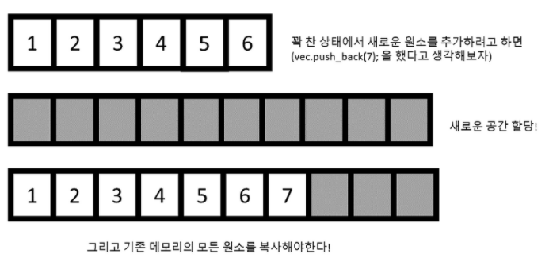

# Vector, 벡터

## 개념
- 번호와 이에 대응하는 데이터로 이루어진 자료구조인 배열과 구조는 같지만, 크기가 동적으로 변할 수 있는 선형 자료구조를 의미한다.
- `size` : 벡터에 존재하는 원소의 총 개수를 의미한다.
- `capacity` : 벡터에 원소를 담을 수 있는 총 개수를 의미한다.

## 주요 연산
### 삽입
- 벡터 맨 뒤에 원소를 추가한다.
	- 시간 복잡도 : `O(1)`
- size가 capacity이상이면, 2배의 capacity를 가진 배열을 생성하여 옮겨담는다.
	- 시간 복잡도 : `O(size)`
```c++
void push_back(const T& val) {
	if (this->_size >= this->_capacity) {
		if (this->_capacity < DEFAULT_CAPACITY)
			this->_capacity = DEFAULT_CAPACITY;
		else
			this->_capacity *= 2;
		T* tmp = new T[this->_capacity];
		for (size_t i = 0; i < this->_size; i++)
			tmp[i] = this->arr[i];
		delete[] this->arr;
		this->arr = tmp;
	}
	this->arr[this->_size++] = val;
}
```

### 삭제
- 벡터 맨 뒤의 원소를 삭제한다.
- 시간 복잡도 : `O(1)`
```c++
void pop_back() { 
	if (this->_size) {
		this->_size--;
		this->arr[this->_size] = T();
	}
}
```

### 탐색
- 벡터에 존재하는 임의의 원소를 탐색한다.
- 시간 복잡도 : `O(1)`
```c++
T& operator[](const size_t& idx) {
	if (idx < this->_size)
		return this->arr[idx];
	cerr << "vector subscript out of range\n";
	exit(0);
}
```

### resize
- 벡터에 parameter로 받은 원소를 추가하여 size를 조정하는 연산이다.
- size < n
	- n-size 만큼 val을 추가한다.
- size >= n
	- 벡터의 size를 n으로 조정하고, 뒤의 원소는 제거한다.
```c++
void resize(const size_t& n, T val = T()) {
	T* tmp = new T[n];
	this->_size = this->_size < n ? _size : n;
	this->_capacity = n;

	for (size_t i = 0; i < this->_size; i++)
		tmp[i] = this->arr[i];
	for (size_t i = this->_size; i < this->_capacity; i++)
		tmp[i] = val;
		
	delete[] this->arr;
	this->arr = tmp;
	this->_size = n;
}
```
### reserve
- 벡터의 capacity를 n으로 증가시키는 연산이다.
```c++
void reserve(const size_t& n) {
	if (n <= this->_capacity)
		return;

	T* tmp = new T[n];
	for (size_t i = 0; i < this->_size; i++)
		tmp[i] = this->arr[i];

	delete[] this->arr;
	this->arr = tmp;
	this->_capacity = n;
}
```
## C++ STL
- 헤더 파일
```c++
#include <vector>
```
- 선언
```c++
vector<T> v;
```
- 반복자
```c++
vector<T>::iterator iter = v.begin(); // *iter은 해당 iterator의 위치의 원소를 반환한다.
auto iter = v.begin(); // C++11 타입 자동 추론 auto

v.begin(); // begin iterator 반환
v.end(); // end iterator 반환

v.rbegin(); // end reverse iterator 반환
v.rend(); // begin reverse iterator 반환

v.cbegin(); // const 형태의 begin() (C++11)
v.cend(); // const 형태의 end() (C++11)
v.crbegin(); // const 형태의 rbegin() (C++11)
v.crend(); // const형태의 rend() (C++11)
```
- 삽입
```c++
v.push_back(element); // 맨 뒤에 원소 추가
v.emplace_back(element); // 불필요한 복사 or 이동 작업을 피하면서 새로운 요소 구성 가능(C++11)

v.insert(iterator, element); // 해당 iterator의 위치의 앞에 원소 추가
v.emplace(iterator, element); // 불필요한 복사 or 이동 작업을 피하면서 새로운 요소 구성 가능(C++11)
```
- 삭제
```c++
v.pop_back(); // 맨 뒤의 원소 삭제
v.erase(iterator); // 해당 iterator의 위치의 원소 삭제
```
- 탐색
```c++
v.front(); // 맨 앞의 원소 반환
v.back(); // 맨 뒤의 원소 반환

// 해당 index의 원소 반환
v[index];
v.at(index);

v.data(); // 요소들을 저장하는 데 내부적으로 사용하는 메모리 배열에 대한 직접 포인터(direct pointer)를 반환
```
- Capacity
```c++
v.empty(); // 비어있는지 여부를 bool 타입으로 반환
v.size(); // 원소의 개수를 반환

v.max_size(); // 컨테이너가 가질 수 있는 요소의 최대 개수를 반환
v.capacity(); // 원소의 수로 표현된 컨테이너에 현재 할당된 저장 공간의 크기를 반환

// 컨테이너의 capacity를 크기에 맞게 줄이고 capacity를 초과하는 모든 요소들을 파괴한다. 
// 이것으로 size() 결과값이 고정되지만, capacity()는 변화한다.
v.shrink_to_fit(); 

v.reserve(n); // capacity를 n으로 증가. 요소의 수를 미리 알고 있는 경우 재할당을 제거하는 데 사용.
v.resize(a); // 원소 개수를 a개로 조정. 앞에서부터 a개의 원소는 변하지 않음.
// a > n인 경우 맨 뒤에 n-a개 만큼 0 또는 빈 문자를 추가한다.
v.resize(a, b); // 원소 개수를 a개로 조정.
// 이전에 존재하던 원소 개수를 n이라 하자.
// a > n 인 경우, 맨 뒤에 n-a개 만큼 b를 추가한다.
```
- Modifiers
```c++
v.clear(); // 모든 원소를 제거한다.
v.assign(n, element); // 기존 원소들은 모두 제거 후, n개의 element를 할당한다.
// parameter로 list 혹은 iterator를 전달할 수도 있다.

v1.swap(v2); // 서로의 원소를 swap한다.
```

